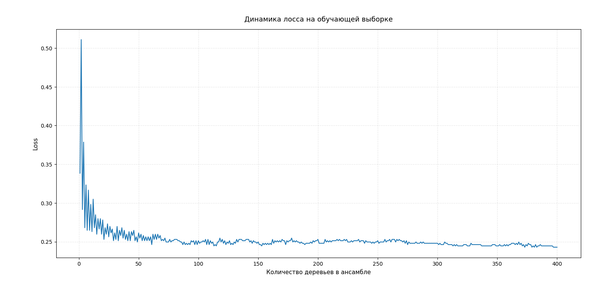

# Лабораторная работа: Реализация ансамбля моделей

## Постановка задачи
Необходимо реализовать алгоритм Random Forest.
Данный метод входит в группу моделей-ансамблей. Ансамбль состоит из более простых т.н.базовых алгоритмов (в нашем случаедеревья решений) с функцией аггрегирующей функцией.
Для повышения разнообразия базовых алгоритмов в Random Forest используется bagging: разбиение выборки на сэмплы с возвращением объектов. Каждое дерево в ансамбле обучается на своей подвыборке. 
Признак в каждой вершине обчающего дерева выбирается случайно из подмножества k из n признаков.

## Описание датасета
В качестве датасета для обучения был выбран датасет muhammedderric/fitness-classification-dataset-synthetic. В нем содержатся данные об образе жизни человека.
Целевой признак is_fit - показывает, находится ли человек в хорошей физической форме (1) или наоборот (0). 
Решается задача бинарной классификации.

## Выполненные этапы

### 1. Реализация алгоритма Random
Был реализован алгоитм Random Forest согласно справочным материалам. В реализацию были дбавлены гиперпараметры количества базовых алгоритмов (n_estimators), размер обучающей подвыборки (l_sample, n_feat), пороговые значения функций ошибки (tol_train, tol_valid), размер подмножества признаков для дерева решений

### 2. Подбор гиперпараметров с помощью OOB и Grid Search
Была реализована несмещенная оценка ошибок oob и модифицирована для передачи в Grid Search из sklearn. Были получены лучшие параметры, на которы производилось сравнение с эталонными реализациями

### 3. Реализовать оценку важности признаков
Был реализован дополнительный метод importance, который возвращает относительное значение роста ошибки при его перемешивании. При высоких значениях показателя модель сильно опирается на признак при обучении.

## 4. Эксперименты.

- Первый эксперимент: предсказание с параметрми, подобранными вручную.
-- Параметры: 
--- количество объектов в семпле (l_sample): 1000
--- Количество признаков в семпле (n_feat): 6
--- Количество базовых алгоритмов (n_estimators): 200
--- Порог функции ошибки на валидации и трейне (tol_val и tol_train): 5
--- Критерий ветвления базовых алгоритмов (criterion): 'gini'
-- Метрики:
--- Accuracy: 0.7337
--- F1: 0.7251
--- Precision: 0.7411

-- График лосса на трейне:

-- График лосса на тесте:

- Второй эксперимент: поиск оптимальных по OOB гиперпараметров через GridSearch
-- Параметры Grid Search: 
--- Количество объектов в семпле (l_sample): [500, 1000]
--- Количество признаков в семпле (n_feat): [5, 8]
--- Количество базовых алгоритмов (n_estimators): [200, 400]
--- Критерии ветвления базовых алгоритмов (criterion): ['gini', 'log_loss']
--- Величина подмножества признаков в вершинах дерева: [3, 5]
-- Лучшие параметры по OOB:
--- количество объектов в семпле (l_sample): 1000
--- Количество признаков в семпле (n_feat): 8
--- Количество базовых алгоритмов (n_estimators): 400
--- Критерии ветвления базовых алгоритмов (criterion): 'log_loss'
--- Величина подмножества признаков в вершинах дерева: 5

-- Метрики:
--- Accuracy: 0.7571
--- F1: 0.7495
--- Precision: 0.7604

-- График лосса на трейне:

-- График лосса на тесте:

- Третий эксперимент: оценка важности признака по OOB (параметры моедли - лучшие по OOB по Grid Search).Показывает во сколько раз увеличивается ошибка при перемешивании признака:
-- age: 4.52
-- height_cm: 0.59
-- weight_kg: 1.98
-- heart_rate: 2.82
-- blood_pressure: 0.00
-- sleep_hours: 0.00
-- nutrition_quality: 11.30
-- activity_index: 32.20
-- smokes: 18.08
-- gender: 0.37

- Четвертый эксперимент: оценка качества модели после удления неинформативных по OOB признаков:
-- Метрики:
--- Accuracy: 0.7487
--- F1: 0.7493
--- Precision: 0.7653

### 4. Сравнение с эталонной реализацией  
Разработанный алгоритм c параметрами полученными после GridSearch сравнивался эталонной реализацией при тех же гиперпараметрах. Результаты приведены в **Таблице 1**.

**Таблица 1.** Сравнение метрик качества классификации

| Модель                     | Accuracy | Precision | F1     |
|----------------------------|----------|-----------|--------|
| Разработанный алгоритм     | 0.7571   | 0.7604    | 0.7495 |
| Эталонная реализация       | 0.7471   | 0.7494    | 0.7391 |

## Интерпретация результатов
В ходе работы был реализован алгоритм Random Forest, который продемонстрировал хорошие результаты по сравнению с эталонной реализацией из sklearn. 
Эксперименты подтвердили корректность оптимизатора OOB: Оптимизация через Grid Search с использованием OOB-оценки позволила повысить F1-меру с 0.58 до 0.78. 
Анализ важности признаков показал не информативные признаки, после удаления которых качество модели подросло.