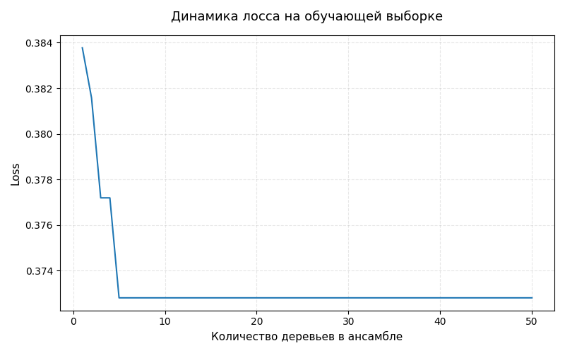
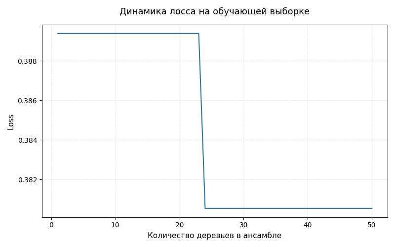

# Лабораторная работа: Реализация алгоритма градиентного бустинга

## Постановка задачи

Необходимо реализовать алгоритм градиентного бустинга, обучить модель на выбранном датасете, оценить качество модели с использованием кросс-валидации, замерить время обучения модели и сравнить результаты с эталонной реализацией из библиотеки `scikit-learn`.

## Описание алгоритма градиентного бустинга

Градиентный бустинг — это ансамблевый метод машинного обучения, в котором итоговая модель строится как сумма нескольких базовых алгоритмов. Каждый следующий базовый алгоритм обучается не на исходные ответы напрямую, а на ошибку текущей композиции.

В данной работе использовалась следующая схема алгоритма.

На вход подается обучающая выборка и параметр `T`, задающий количество базовых алгоритмов. На выходе получается набор базовых алгоритмов `b_t` и их весов `α_t`.

В качестве базового алгоритма использовалось решающее дерево регрессии `DecisionTreeRegressor`, так как антиградиент является вещественным числом, а не меткой класса.

## Описание датасета

В качестве датасета был выбран встроенный датасет `breast_cancer` из библиотеки `scikit-learn`.

Датасет содержит данные о характеристиках опухолей молочной железы. На основе числовых признаков необходимо определить, является опухоль доброкачественной или злокачественной.

Основные характеристики датасета:

- количество объектов: 569;
- количество признаков: 30;
- тип задачи: бинарная классификация;
- целевая переменная: класс опухоли;
- классы: `0` и `1`.

В работе решалась задача бинарной классификации. 

## Выполненные этапы

### 1. Реализация алгоритма градиентного бустинга

В реализации были добавлены следующие основные параметры:

- `n_estimators` — количество базовых алгоритмов;
- `max_depth` — максимальная глубина дерева;
- `min_samples_leaf` — минимальное количество объектов в листе дерева;
- `random_state` — параметр для воспроизводимости результата.

Внутри алгоритма на каждой итерации вычислялся антиградиент функции потерь, после чего обучалось дерево регрессии. Далее с помощью одномерной минимизации подбирался коэффициент `α_t`, определяющий вклад очередного дерева в итоговую композицию.

### 2. Обучение модели

Модель обучалась на датасете `breast_cancer`.

Для проверки качества использовалась стратифицированная кросс-валидация на 5 фолдах. Стратификация нужна для того, чтобы в каждом фолде сохранялось примерно одинаковое соотношение классов.

### 3. Оценка качества модели

Для оценки качества использовались следующие метрики:

- `Accuracy` — доля правильно классифицированных объектов;
- `Precision` — точность положительного класса;
- `F1-score` — гармоническое среднее между precision и recall.

Также для каждого фолда измерялось время обучения модели.

### 4. Сравнение с эталонной реализацией

Собственная реализация сравнивалась с `GradientBoostingClassifier` из библиотеки `scikit-learn`.

Для корректного сравнения у обеих моделей были установлены одинаковые основные параметры:

```text
n_estimators = 50
max_depth = 3
min_samples_leaf = 5
random_state = 42
```

## Эксперименты

### Первый эксперимент: обучение собственной реализации градиентного бустинга

Параметры модели:

- количество базовых алгоритмов `n_estimators`: 50;
- максимальная глубина дерева `max_depth`: 3;
- минимальное количество объектов в листе `min_samples_leaf`: 5;
- функция потерь: логистическая;
- базовый алгоритм: дерево регрессии.

Результаты по фолдам:

| Fold | Accuracy | Precision | F1-score | Время обучения, сек |
|------|----------|-----------|----------|---------------------|
| 1    | 0.9474   | 0.9710    | 0.9571   | 0.1965              |
| 2    | 0.9123   | 0.9067    | 0.9315   | 0.1775              |
| 3    | 0.9298   | 0.9211    | 0.9459   | 0.1910              |
| 4    | 0.9474   | 0.9853    | 0.9571   | 0.1837              |
| 5    | 0.9558   | 0.9459    | 0.9655   | 0.1700              |

Средние результаты собственной реализации:

| Метрика | Значение |
|---------|----------|
| Accuracy | 0.9385 |
| Precision | 0.9460 |
| F1-score | 0.9515 |
| Среднее время обучения | 0.1838 сек |


-- График лосса на трейне:


-- График лосса на тесте:



### Второй эксперимент: обучение эталонной реализации из sklearn

Для сравнения была обучена модель `GradientBoostingClassifier` из библиотеки `scikit-learn`.

Параметры модели:

- количество базовых алгоритмов `n_estimators`: 50;
- максимальная глубина дерева `max_depth`: 3;
- минимальное количество объектов в листе `min_samples_leaf`: 5;
- `random_state`: 42.

Результаты по фолдам:

| Fold | Accuracy | Precision | F1-score | Время обучения, сек |
|------|----------|-----------|----------|---------------------|
| 1    | 0.9561   | 0.9714    | 0.9645   | 0.1703              |
| 2    | 0.9123   | 0.9067    | 0.9315   | 0.1643              |
| 3    | 0.9561   | 0.9467    | 0.9660   | 0.1685              |
| 4    | 0.9561   | 0.9855    | 0.9645   | 0.1578              |
| 5    | 0.9646   | 0.9589    | 0.9722   | 0.1697              |

Средние результаты эталонной реализации:

| Метрика | Значение |
|---------|----------|
| Accuracy | 0.9491 |
| Precision | 0.9538 |
| F1-score | 0.9598 |
| Среднее время обучения | 0.1661 сек |

## Сравнение с эталонной реализацией

**Таблица 1.** Сравнение качества и времени обучения моделей

| Модель | Accuracy | Precision | F1-score | Среднее время обучения, сек |
|--------|----------|-----------|----------|-----------------------------|
| Разработанный алгоритм | 0.9385 | 0.9460 | 0.9515 | 0.1838 |
| GradientBoostingClassifier sklearn | 0.9491 | 0.9538 | 0.9598 | 0.1661 |

По результатам экспериментов видно, что собственная реализация градиентного бустинга показывает качество, близкое к эталонной реализации из `scikit-learn`. Средняя accuracy собственной модели составила `0.9385`, тогда как у библиотечной реализации — `0.9491`.

При этом эталонная реализация обучается немного быстрее. Среднее время обучения собственной модели составило `0.1838` секунды, а среднее время обучения модели из `scikit-learn` — `0.1661` секунды.

Разница во времени объясняется тем, что библиотечная реализация оптимизирована, а в собственной реализации на каждой итерации дополнительно выполняется одномерная минимизация для поиска оптимального коэффициента `α_t`.

## Интерпретация результатов

В ходе работы был реализован алгоритм градиентного бустинга для задачи бинарной классификации. Алгоритм был построен согласно теоретической схеме: на каждой итерации вычислялся антиградиент функции потерь, обучался базовый алгоритм, подбирался вес базового алгоритма и обновлялась текущая композиция.

Эксперименты показали, что разработанный алгоритм способен решать задачу бинарной классификации и дает качество, сопоставимое с эталонной реализацией из библиотеки `scikit-learn`.

Небольшое отставание собственной реализации по качеству и времени обучения является ожидаемым. Библиотечная реализация содержит дополнительные оптимизации, более эффективную работу с деревьями решений и тщательно подобранные детали алгоритма.
