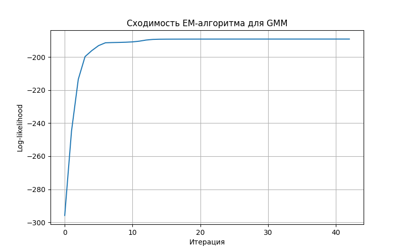

# Лабораторная работа: Реализация Gaussian Mixture Model

## Постановка задачи

Необходимо реализовать алгоритм Gaussian Mixture Model, обучить модель на выбранном датасете, оценить качество модели через ПМП и сравнить результаты с эталонной реализацией

## Описание алгоритма Gaussian Mixture Model

Gaussian Mixture Model — это вероятностная модель, которая представляет распределение данных как смесь нескольких многомерных нормальных распределений. Каждая компонента смеси задается тремя параметрами:

- вес компоненты `w_j`;
- вектор среднего `mu_j`;
- ковариационная матрица `Sigma_j`.

Для обучения модели используется EM-алгоритм. Он состоит из двух шагов, которые повторяются до сходимости.

На **E-шаге** вычисляется вероятность принадлежности каждого объекта к каждой компоненте смеси. Эти вероятности также называются responsibilities.

На **M-шаге** обновляются параметры модели: веса компонент, средние значения и ковариационные матрицы. Новые параметры вычисляются с учетом вероятностей принадлежности объектов к компонентам.

Итерации продолжаются до тех пор, пока значение log-likelihood не перестает существенно изменяться.

## Описание датасета

В качестве датасета был выбран `Iris Dataset`.

Датасет содержит измерения цветков ириса. На основе числовых признаков можно выделить три группы объектов, соответствующие трем видам ириса.

Основные характеристики датасета:

- количество объектов: 150;
- количество признаков: 4;
- количество классов: 3;
- признаки: длина и ширина чашелистика, длина и ширина лепестка;
- классы: `setosa`, `versicolor`, `virginica`.

## Выполненные этапы

### 1. Реализация GMM

Была реализована собственная версия Gaussian Mixture Model с параметрами:

- `n_components` — количество компонент смеси;
- `max_iter` — максимальное количество итераций EM-алгоритма;
- `tol` — порог сходимости;
- `random_state` — параметр для воспроизводимости результата.

### 2. Обучение модели

Собственная модель GMM обучалась со следующими параметрами:

```text
n_components = 3
max_iter = 100
tol = 1e-4
random_state = 42
```

### 3. Оценка качества модели

Основной способ оценки качества — ПМП, то есть принцип максимального правдоподобия. Для этого вычислялись:

- полный log-likelihood на обучающей выборке;
- полный log-likelihood на тестовой выборке;
- средний log-likelihood на обучающей выборке;
- средний log-likelihood на тестовой выборке.

Также была рассчитана `Accuracy`. Так как GMM является алгоритмом кластеризации и не знает реальные номера классов, перед расчетом accuracy номера кластеров были сопоставлены с настоящими классами с помощью оптимального сопоставления.

### 4. Сравнение с эталонной реализацией

Для сравнения была использована модель `GaussianMixture` из библиотеки `scikit-learn`.

Параметры эталонной модели:

```text
n_components = 3
covariance_type = "full"
max_iter = 100
tol = 1e-4
random_state = 42
```

## Эксперименты

### Первый эксперимент: обучение собственной реализации GMM

Параметры модели:

- количество компонент смеси `n_components`: 3;
- тип ковариационной матрицы: полная ковариационная матрица;
- максимальное количество итераций: 100;
- критерий сходимости `tol`: 1e-4.

Результаты собственной реализации:

| Метрика | Значение |
|---------|----------|
| Train log-likelihood | -189.083542 |
| Test log-likelihood | -107.184776 |
| Train mean log-likelihood | -1.800796 |
| Test mean log-likelihood | -2.381884 |
| Accuracy | 0.777778 |

График сходимости EM-алгоритма:



### Второй эксперимент: обучение эталонной реализации из sklearn

Для сравнения была обучена модель `GaussianMixture` из библиотеки `scikit-learn`.

Результаты эталонной реализации:

| Метрика | Значение |
|---------|----------|
| Train log-likelihood | -190.978929 |
| Test log-likelihood | -109.557786 |
| Train mean log-likelihood | -1.818847 |
| Test mean log-likelihood | -2.434617 |
| Accuracy | 0.844444 |

## Сравнение с эталонной реализацией

**Таблица 1.** Сравнение собственной реализации GMM и реализации из `scikit-learn`.

| Модель | Train log-likelihood | Test log-likelihood | Train mean log-likelihood | Test mean log-likelihood | Accuracy |
|--------|----------------------|---------------------|---------------------------|--------------------------|----------|
| Разработанный алгоритм | -189.083542 | -107.184776 | -1.800796 | -2.381884 | 0.777778 |
| GaussianMixture sklearn | -190.978929 | -109.557786 | -1.818847 | -2.434617 | 0.844444 |

По результатам экспериментов видно, что собственная реализация GMM показывает значения log-likelihood, близкие к эталонной реализации из `scikit-learn`.

## Интерпретация результатов

В ходе работы была реализована модель Gaussian Mixture Model для восстановления плотности распределения. Реализация основана на EM-алгоритме: на E-шаге вычисляются вероятности принадлежности объектов к компонентам смеси, а на M-шаге обновляются веса, средние значения и ковариационные матрицы.

Качество модели оценивалось через принцип максимального правдоподобия. Для этого использовались значения полного и среднего log-likelihood на обучающей и тестовой выборках. Полученные значения показывают, насколько хорошо модель описывает распределение данных.

Сравнение с `GaussianMixture` из `scikit-learn` показало, что собственная реализация дает близкие значения log-likelihood. Это подтверждает корректность реализации основных шагов EM-алгоритма.
