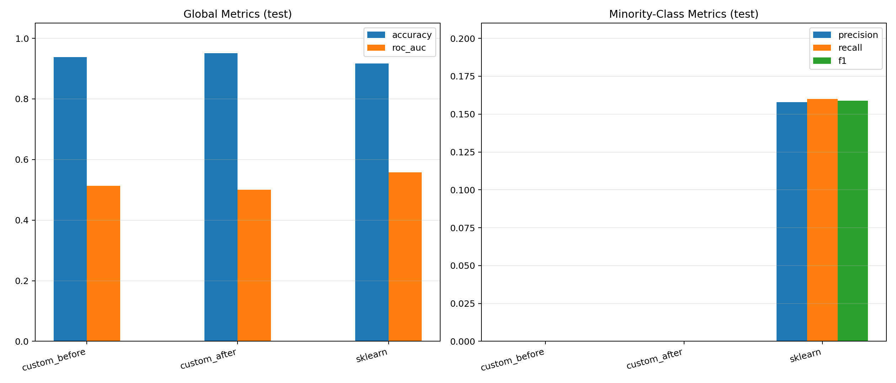
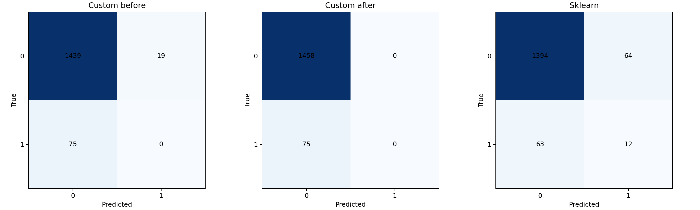

# Лабораторная работа №1. Decision Tree (ID3 + Gini)

В рамках лабораторной работы реализовано собственное дерево решений для бинарной классификации, обработка пропусков через вероятностную оценку, редукция дерева и сравнение с эталонной реализацией `sklearn`.

## Задание

1. выбрать датасет для классификации;
2. использовать датасет с пропусками, категориальными и количественными признаками;
3. реализовать алгоритм дерева ID3 с критерием Джини;
4. реализовать обработку пропущенных значений через оценку вероятности;
5. обучить дерево на выбранном датасете;
6. оценить качество классификации;
7. реализовать редукцию дерева;
8. сравнить качество до и после редукции;
9. сравнить с эталонной реализацией бинарного дерева;
10. подготовить отчет.

## Отчет

1. В качестве датасета выбран [`Stroke Prediction Dataset`](https://www.kaggle.com/datasets/fedesoriano/stroke-prediction-dataset) с задачей бинарной классификации (`stroke`).

   Особенности датасета:
   - есть пропуски (например, в `bmi`);
   - есть категориальные признаки (`gender`, `ever_married`, `work_type`, `Residence_type`, `smoking_status`);
   - есть количественные признаки (`age`, `avg_glucose_level`, `bmi`, и др.).

2. [Собственная реализация дерева](./src/model/decision_tree.py)

   Реализован класс `DecisionTree`:
   - критерий разбиения: Джини;
   - обработка пропусков на предсказании: если значение признака отсутствует, вероятность класса вычисляется как взвешенная сумма вероятностей по дочерним веткам (`branch_probs`);
   - редукция дерева: метод `prune_inner(X_val, y_val)` (post-pruning, reduced-error pruning), который сворачивает внутренние узлы в лист, если это не ухудшает качество на валидации.

3. [Сценарий обучения и сравнения](./src/main.py)

   Реализован полный эксперимент:
   - деление на `train/val/test`;
   - обучение и оценка `Custom tree` до и после редукции;
   - обучение и оценка `sklearn.tree.DecisionTreeClassifier` (без редукции).

4. Оценка качества

   Считаются метрики классификации:
   - `accuracy`, `precision`, `recall`, `f1`, `roc_auc`.

5. Графики

   После запуска автоматически строятся графики:
   - Сравнение классификационных метрик:
     
   - Матрицы ошибок для всех моделей:
     

6. Сравнение качества работы

   Сравнение выполняется по трем моделям:
   - `custom_before`
   - `custom_after`
   - `sklearn`

   Наиболее важные выводы делаются по `f1/recall/roc_auc` (для редкого положительного класса).

## Запуск

Из директории `lab1`:

```bash
python src/main.py
```

После запуска все результаты сохраняются в `lab1/artifacts`.
