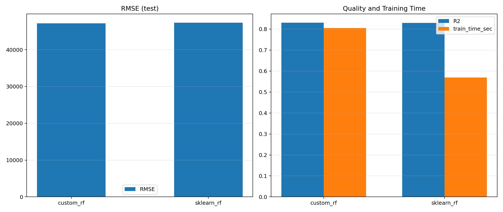
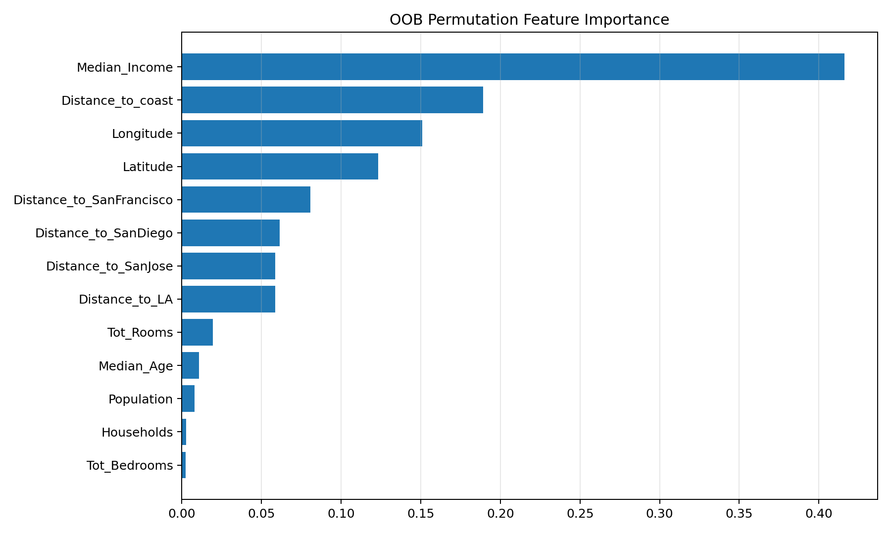

# Лабораторная работа №2. Ансамбли моделей

В работе реализован вариант `Random Forest` для задачи регрессии на датасете California Housing. В качестве базового алгоритма внутри ансамбля используется `sklearn.tree.DecisionTreeRegressor`.

## Что сделано

1. Выбран датасет [`California Houses`](https://www.kaggle.com/datasets/fedesoriano/california-housing-prices-data-extra-features).
2. Реализован собственный класс [`RandomForestRegressorCustom`](./src/model/random_forest.py):
   - bootstrap по объектам;
   - случайный выбор подпространства признаков для каждого дерева;
   - OOB-предсказания и `OOB R2`;
   - OOB permutation importance (`OOB^j`).
3. В [`main.py`](./src/main.py):
   - выполняется `GridSearchCV` по `oob_score_`;
   - обучается собственная модель;
   - обучается эталонная `sklearn.ensemble.RandomForestRegressor` с теми же параметрами;
   - считается качество на тесте и время обучения;
   - сохраняются графики.

## Метрики

Для сравнения используются:

- `RMSE`
- `R2`
- время обучения

## Что добавить в отчет

- краткое описание метода `Random Forest`;
- описание датасета;
- лучшие гиперпараметры после `GridSearchCV`;
- сравнение собственной реализации и `sklearn`;
- график с метриками `RMSE/R2` и временем обучения;
- график важности признаков по `OOB^j`;
- итоговые выводы.

### Описание датасета

В качестве исходных данных выбран датасет `California Houses`. Целевая переменная: `Median_House_Value`. Признаки описывают характеристики домов и района, включая географические координаты, площадь, число комнат, число спален, численность населения и другие параметры. Задача является задачей регрессии, так как требуется предсказать числовое значение стоимости жилья.

### Результаты экспериментов

Для оценки качества использовались метрики `RMSE` и `R2`. Дополнительно сравнивалось время обучения собственной реализации и библиотечной реализации `sklearn`.

Итоговые результаты удобно представить в виде таблицы:

| Модель | RMSE | R2 | Время обучения, сек |
|---|---:|---:|---:|
| Собственная реализация Random Forest | 47249 | 0.8299 | 4.8153 |
| RandomForestRegressor из sklearn | 48284 | 0.8224 | 3.0091 |

График сравнения метрик и времени обучения:



График важности признаков по `OOB^j`:




### Выводы

В ходе работы была реализована минимальная версия `Random Forest` для регрессии и выполнено сравнение с реализацией из `sklearn`. Подбор гиперпараметров по `OOB` позволил выбрать рабочую конфигурацию ансамбля. Дополнительно была получена оценка важности признаков через `OOB^j`, что позволило интерпретировать поведение модели. Эталонная реализация `sklearn` используется как ориентир по качеству и скорости обучения.

## Запуск

```bash
pip install -r requirements.txt
python src/main.py
```
