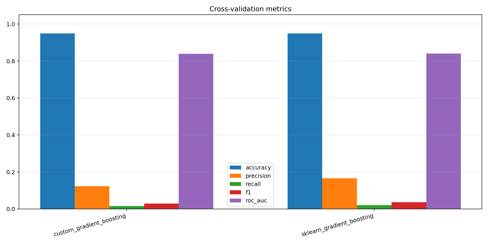
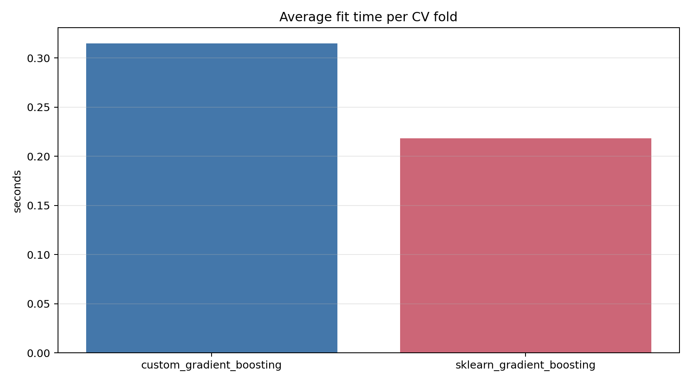

# Лабораторная работа №3. Градиентный бустинг

В рамках лабораторной работы требуется реализовать собственный алгоритм градиентного бустинга и сравнить его с эталонной реализацией `sklearn.ensemble.GradientBoostingClassifier`.

## Задание

1. Выбрать датасет для анализа.
2. Реализовать алгоритм градиентного бустинга.
3. Обучить модель на выбранном датасете.
4. Оценить качество модели с использованием кросс-валидации.
5. Замерить время обучения модели.
6. Сравнить собственную реализацию с `scikit-learn`:
   - точность модели;
   - время обучения.
7. Подготовить отчет.

## Датасет

В качестве датасета выбран [`Stroke Prediction Dataset`](https://www.kaggle.com/datasets/fedesoriano/stroke-prediction-dataset).

Целевая переменная: `stroke`.

Особенности датасета:
- задача бинарной классификации;
- есть числовые признаки: `age`, `hypertension`, `heart_disease`, `avg_glucose_level`, `bmi`;
- есть категориальные признаки: `gender`, `ever_married`, `work_type`, `Residence_type`, `smoking_status`;
- в признаке `bmi` есть пропуски, которые заполняются медианой;
- категориальные признаки кодируются с помощью `LabelEncoder`.

## Реализация

Собственная реализация находится в файле [`src/model/gradient_boosting.py`](./src/model/gradient_boosting.py).

Класс `GradientBoostingClassifier` используется со следующим интерфейсом:

```python
model.fit(X_train, y_train)
model.predict(X_test)
model.predict_proba(X_test)
```

Метод `predict_proba` возвращает одномерный массив вероятностей положительного класса. Код эксперимента в [`src/main.py`](./src/main.py) также поддерживает `sklearn`-формат вероятностей, чтобы сравнение с эталонной моделью выполнялось в одном сценарии.

## Описание алгоритма градиентного бустинга

Градиентный бустинг строит ансамбль слабых моделей последовательно. Каждая следующая модель обучается исправлять ошибки текущего ансамбля.

Для бинарной классификации обычно используется логистическая функция потерь. На каждой итерации:

1. вычисляются текущие предсказания ансамбля;
2. считаются антиградиенты функции потерь по предсказаниям;
3. обучается очередное дерево решений на этих антиградиентах;
4. предсказание ансамбля обновляется с учетом найденного коэффициента шага;
5. после всех итераций итоговые значения переводятся в вероятности класса.

Основные параметры:
- `n_estimators` — количество деревьев;
- `max_depth` — максимальная глубина базовых деревьев.

## Графики

После запуска строятся:

- средние метрики на кросс-валидации:
  
- среднее время обучения:
  

## Запуск

Из директории `lab3`:

```bash
python src/main.py
```

При первом запуске `kagglehub` скачает датасет.
