# Отчет по лабораторной работе №1

## 1. Цель работы

Цель работы — реализовать собственное решающее дерево в стиле ID3 и сравнить его с эталонной реализацией бинарного решающего дерева из `scikit-learn`.

В проекте реализованы две модели:

- `MyDecisionTreeClassifier`;
- `MyDecisionTreeRegressor`.

## 2. Задание

Точный текст задания:

```
1. выбрать датасет для классификации, например на kaggle (https://www.kaggle.com/datasets?tags=13302-Classification);
   1. датасет должен содержать пропуски;
   2. датасет должен содержать категориальные и количественные признаки;
2. реализовать алгоритм построения дерева ID3 с критерием Джини;
3. реализовать обработку пропущенных значений через оценку вероятности;
4. обучить дерево на выбранном датасете;
5. оценить качество классификации;
6. реализовать алгоритм редукции дерева;
7. сравнить качество классификации и регрессии до и после редукции дерева;
8. сравнить с эталонной (https://scikit-learn.org/stable/) реализацией бинарного решающего дерева;
    1. сравнить качество работы;
9. подготовить небольшой отчет о проделанной работе.
```

Факт выполнения:

- [x] выбран OpenML dataset `1000`;
- [x] датасет содержит пропуски, категориальные и числовые признаки;
- [x] реализовано ID3-style построение дерева по максимальному impurity gain;
- [x] для классификации поддержан критерий Джини;
- [x] пропуски обрабатываются вероятностной маршрутизацией;
- [x] дерево обучается через CLI-конфиги;
- [x] качество классификации и регрессии считается автоматически;
- [x] реализован Minimal Cost-Complexity Pruning;
- [x] добавлено сравнение с `DecisionTreeClassifier` и `DecisionTreeRegressor`;
- [x] результаты сохраняются в `results/experiments/`.

## 3. Структура проекта

```text
.
├── configs/
├── data/
│   ├── raw/
│   └── processed/
├── src/
│   ├── preprocess.py
│   ├── metrics.py
│   ├── visualization.py
│   ├── tree/
│   │   ├── tree_node.py
│   │   └── decision_tree.py
│   └── experiments/
│       ├── cli.py
│       ├── config.py
│       ├── runner.py
│       ├── pruning.py
│       └── sklearn_baselines.py
├── results/
│   └── experiments/
├── TASK.md
└── README.md
```

`src/tree/` содержит только собственную реализацию дерева. Сравнение со sklearn и preprocessing для baseline-моделей вынесены в `src/experiments/`.

## 4. Датасет

Используется OpenML dataset **hypothyroid**, загружаемый через:

```python
fetch_openml(data_id=1000, as_frame=True)
```

В датасете около 3772 объектов и около 30 признаков. Целевая переменная для классификации — `binaryClass`. Для регрессии целевая переменная — `age`, а `binaryClass` может использоваться как один из признаков.

## 5. Предобработка данных

Для кастомных моделей обычная импутация признаков не применяется. Значения `"?"` заменяются на `np.nan`, а пропуски остаются в `DataFrame` и обрабатываются внутри дерева.

Для sklearn baseline применяется отдельный pipeline:

- числовые признаки: `SimpleImputer(strategy="median")`;
- категориальные признаки: `SimpleImputer(strategy="most_frequent")` и `OneHotEncoder(handle_unknown="ignore")`.

Технические признаки с `measured` в названии удаляются, если это включено в конфиге.

## 6. Теоретическая часть

### 6.1. ID3-style построение дерева

Классический ID3 был рассчитан на классификацию и категориальные признаки. В этой работе реализован расширенный ID3-style алгоритм: в каждой вершине перебираются допустимые бинарные split-кандидаты, после чего выбирается split с максимальным уменьшением impurity.

### 6.2. Gini gain и entropy gain

Для классификации поддержаны `gini` и `entropy`. Основная формула выбора split:

```text
Gain(split) = impurity(parent) - weighted_impurity(children)
```

По умолчанию используется критерий Джини:

```text
Gini(D) = 1 - sum_k p_k^2
```

### 6.3. Числовые и категориальные признаки

Числовой split имеет вид:

```text
x_j <= threshold
```

Пороги строятся как середины между соседними уникальными непустыми значениями.

Категориальный split имеет вид:

```text
x_j == category
```

Используется one-vs-rest перебор категорий. Полный перебор всех подмножеств категорий не реализуется, потому что он избыточен для этой лабораторной работы.

### 6.4. Обработка пропусков через вероятностную маршрутизацию

При обучении split оценивается только на объектах, где split-признак известен. В узле сохраняются вероятности перехода:

```text
q_left = n_left / n_known
q_right = n_right / n_known
```

На этапе предсказания объект с пропуском в split-признаке не отправляется в одну ветвь произвольно. Предсказания дочерних поддеревьев смешиваются с весами `q_left` и `q_right`.

### 6.5. Регрессионное дерево

Для регрессии используется критерий `squared_error`. Лист хранит среднее значение `y`, а impurity узла считается как MSE относительно среднего.

### 6.6. Minimal Cost-Complexity Pruning

Редукция дерева реализована через weakest-link pruning:

```text
C_alpha(T) = R(T) + alpha * |T|
```

Для каждого внутреннего узла считается:

```text
alpha_eff(t) = (R(t) - R(T_t)) / (|T_t| - 1)
```

Узел с минимальным `alpha_eff` считается самым слабым звеном и сворачивается в лист. Метод `cost_complexity_pruning_path(X, y)` возвращает массивы `ccp_alphas` и `impurities`.

## 7. Эксперименты

Эксперименты запускаются командами:

```bash
uv run python -m src.experiments.cli --config configs/classification_default.yaml
uv run python -m src.experiments.cli --config configs/regression_pruned.yaml
uv run python -m src.experiments.cli --run-all
```

Для каждого конфига обучаются две модели:

- custom decision tree;
- sklearn baseline.

Сохраняются `params.json`, `metrics.csv`, `metrics.md`, таблицы подбора `ccp_alpha` и графики в `results/experiments/<experiment_name>/`.

## 8. Результаты классификации

Классификационные метрики: accuracy, precision, recall, f1 и ROC-AUC.

### 8.1. classification_default

| model | task | parameters | accuracy | precision | recall | f1 | roc_auc | fit_time | predict_time | depth | leaves | node_count |
| --- | --- | --- | --- | --- | --- | --- | --- | --- | --- | --- | --- | --- |
| custom | classification | {"criterion": "gini", "max_depth": null, "min_samples_split": 2, "min_samples_leaf": 1, "min_impurity_decrease": 0.0, "ccp_alpha": 0.0, "random_state": 42} | 0.996819 | 0.998849 | 0.997701 | 0.998275 | 0.991151 | 0.224001 | 0.0283765 | 8 | 15 | 29 |
| sklearn | classification | {"criterion": "gini", "max_depth": null, "min_samples_split": 2, "min_samples_leaf": 1, "min_impurity_decrease": 0.0, "ccp_alpha": 0.0, "random_state": 42} | 0.997879 | 0.998851 | 0.998851 | 0.998851 | 0.992576 | 0.0219535 | 0.00600446 | 8 | 15 | 29 |

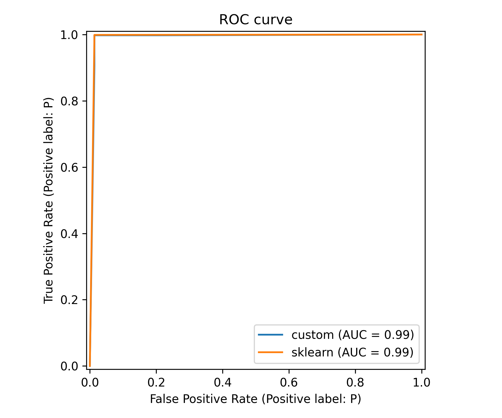

### 8.2. classification_depth_3

| model | task | parameters | accuracy | precision | recall | f1 | roc_auc | fit_time | predict_time | depth | leaves | node_count |
| --- | --- | --- | --- | --- | --- | --- | --- | --- | --- | --- | --- | --- |
| custom | classification | {"criterion": "gini", "max_depth": 3, "min_samples_split": 2, "min_samples_leaf": 1, "min_impurity_decrease": 0.0, "ccp_alpha": 0.0, "random_state": 42} | 0.995758 | 0.998848 | 0.996552 | 0.997699 | 0.990726 | 0.135677 | 0.0250914 | 3 | 7 | 13 |
| sklearn | classification | {"criterion": "gini", "max_depth": 3, "min_samples_split": 2, "min_samples_leaf": 1, "min_impurity_decrease": 0.0, "ccp_alpha": 0.0, "random_state": 42} | 0.995758 | 0.997701 | 0.997701 | 0.997701 | 0.991954 | 0.0196076 | 0.00713051 | 3 | 7 | 13 |

### 8.3. classification_depth_7

| model | task | parameters | accuracy | precision | recall | f1 | roc_auc | fit_time | predict_time | depth | leaves | node_count |
| --- | --- | --- | --- | --- | --- | --- | --- | --- | --- | --- | --- | --- |
| custom | classification | {"criterion": "gini", "max_depth": 7, "min_samples_split": 2, "min_samples_leaf": 1, "min_impurity_decrease": 0.0, "ccp_alpha": 0.0, "random_state": 42} | 0.996819 | 0.998849 | 0.997701 | 0.998275 | 0.991151 | 0.218521 | 0.0277906 | 7 | 14 | 27 |
| sklearn | classification | {"criterion": "gini", "max_depth": 7, "min_samples_split": 2, "min_samples_leaf": 1, "min_impurity_decrease": 0.0, "ccp_alpha": 0.0, "random_state": 42} | 0.996819 | 0.998849 | 0.997701 | 0.998275 | 0.992001 | 0.0198884 | 0.00663062 | 7 | 14 | 27 |

### 8.4. classification_leaf_split

| model | task | parameters | accuracy | precision | recall | f1 | roc_auc | fit_time | predict_time | depth | leaves | node_count |
| --- | --- | --- | --- | --- | --- | --- | --- | --- | --- | --- | --- | --- |
| custom | classification | {"criterion": "gini", "max_depth": null, "min_samples_split": 20, "min_samples_leaf": 50, "min_impurity_decrease": 0.0, "ccp_alpha": 0.0, "random_state": 42} | 0.994698 | 0.998847 | 0.995402 | 0.997121 | 0.995993 | 0.111309 | 0.0253842 | 4 | 6 | 11 |
| sklearn | classification | {"criterion": "gini", "max_depth": null, "min_samples_split": 20, "min_samples_leaf": 50, "min_impurity_decrease": 0.0, "ccp_alpha": 0.0, "random_state": 42} | 0.994698 | 0.998847 | 0.995402 | 0.997121 | 0.997441 | 0.0191189 | 0.00612131 | 4 | 6 | 11 |

### 8.5. classification_pruned

| model | task | parameters | accuracy | precision | recall | f1 | roc_auc | fit_time | predict_time | depth | leaves | node_count |
| --- | --- | --- | --- | --- | --- | --- | --- | --- | --- | --- | --- | --- |
| custom | classification | {"criterion": "gini", "max_depth": 12, "min_samples_split": 2, "min_samples_leaf": 1, "min_impurity_decrease": 0.0, "ccp_alpha": 0.0, "random_state": 42} | 0.996819 | 0.998849 | 0.997701 | 0.998275 | 0.991151 | 0.216116 | 0.0256846 | 8 | 15 | 29 |
| sklearn | classification | {"criterion": "gini", "max_depth": 12, "min_samples_split": 2, "min_samples_leaf": 1, "min_impurity_decrease": 0.0, "ccp_alpha": 0.0, "random_state": 42} | 0.997879 | 0.998851 | 0.998851 | 0.998851 | 0.992576 | 0.0184998 | 0.005719 | 8 | 15 | 29 |

#### Custom model's confusion matrix

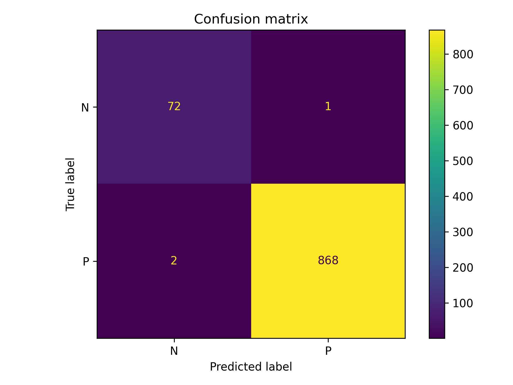

#### Sklearn model's confusion matrix


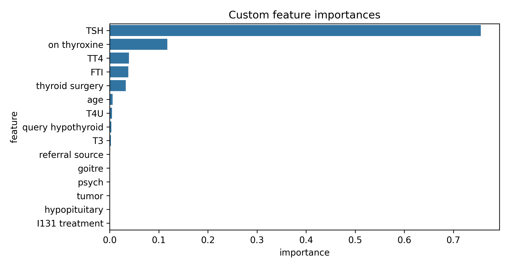

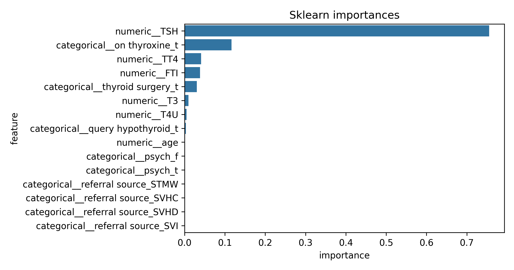

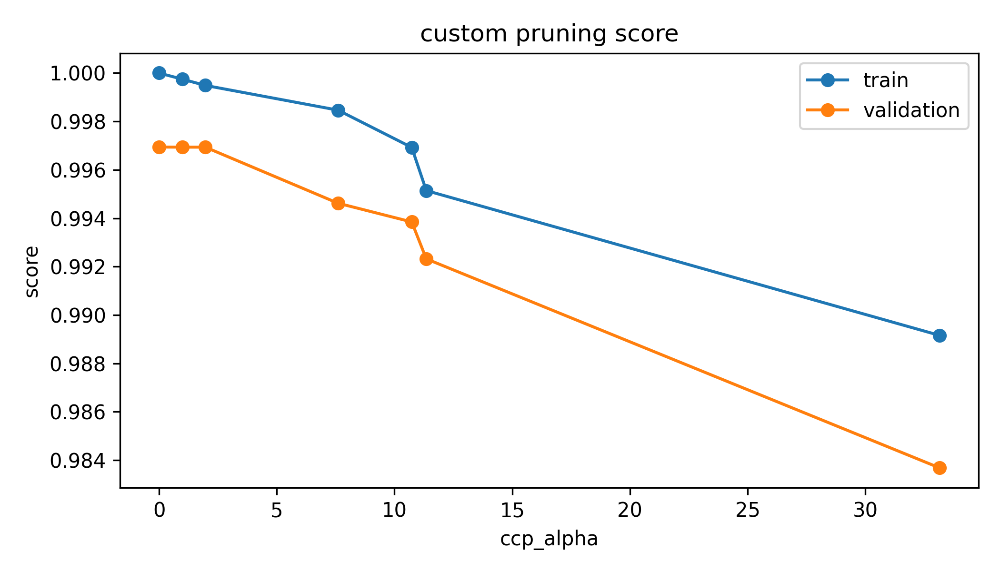

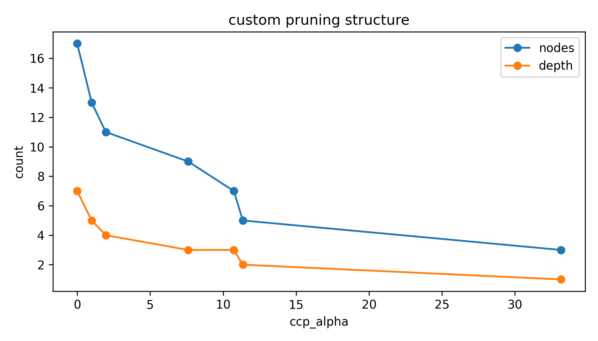

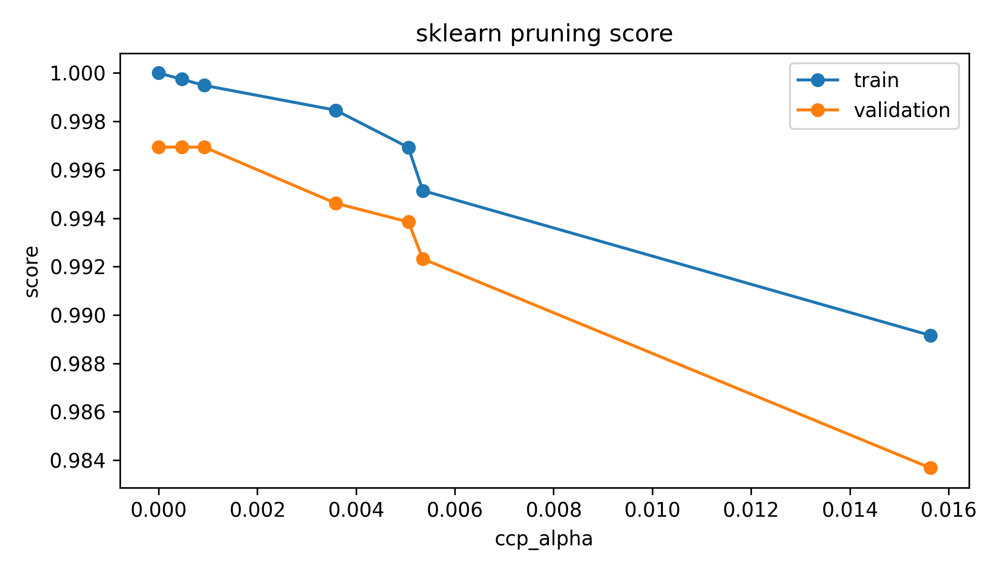

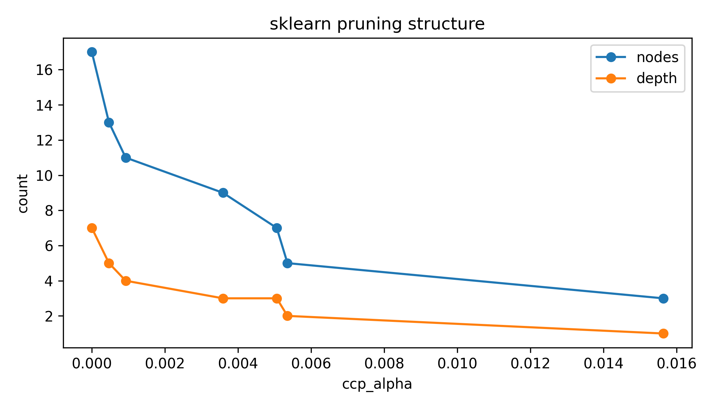

#### Sklearn model's tree visualization

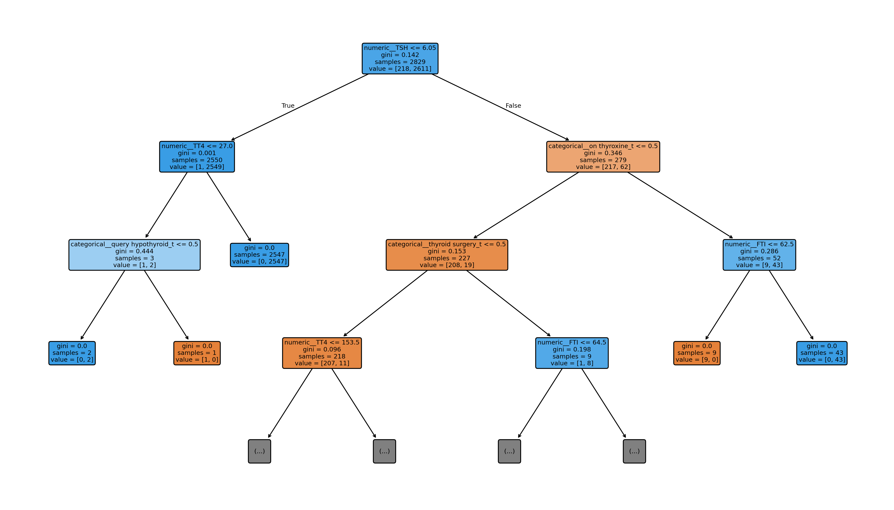

## 9. Результаты регрессии

Регрессионные метрики: MSE, RMSE, MAE и R2.

### 9.1. regression_default

| model | task | parameters | mse | rmse | mae | r2 | fit_time | predict_time | depth | leaves | node_count |
| --- | --- | --- | --- | --- | --- | --- | --- | --- | --- | --- | --- |
| custom | regression | {"criterion": "squared_error", "max_depth": null, "min_samples_split": 2, "min_samples_leaf": 1, "min_impurity_decrease": 0.0, "ccp_alpha": 0.0, "random_state": 42} | 493.195 | 22.208 | 17.4797 | -0.358781 | 10.5432 | 0.22031 | 39 | 1903 | 3805 |
| sklearn | regression | {"criterion": "squared_error", "max_depth": null, "min_samples_split": 2, "min_samples_leaf": 1, "min_impurity_decrease": 0.0, "ccp_alpha": 0.0, "random_state": 42} | 724.014 | 26.9075 | 19.2792 | -0.9947 | 0.0330528 | 0.00691235 | 36 | 2538 | 5075 |

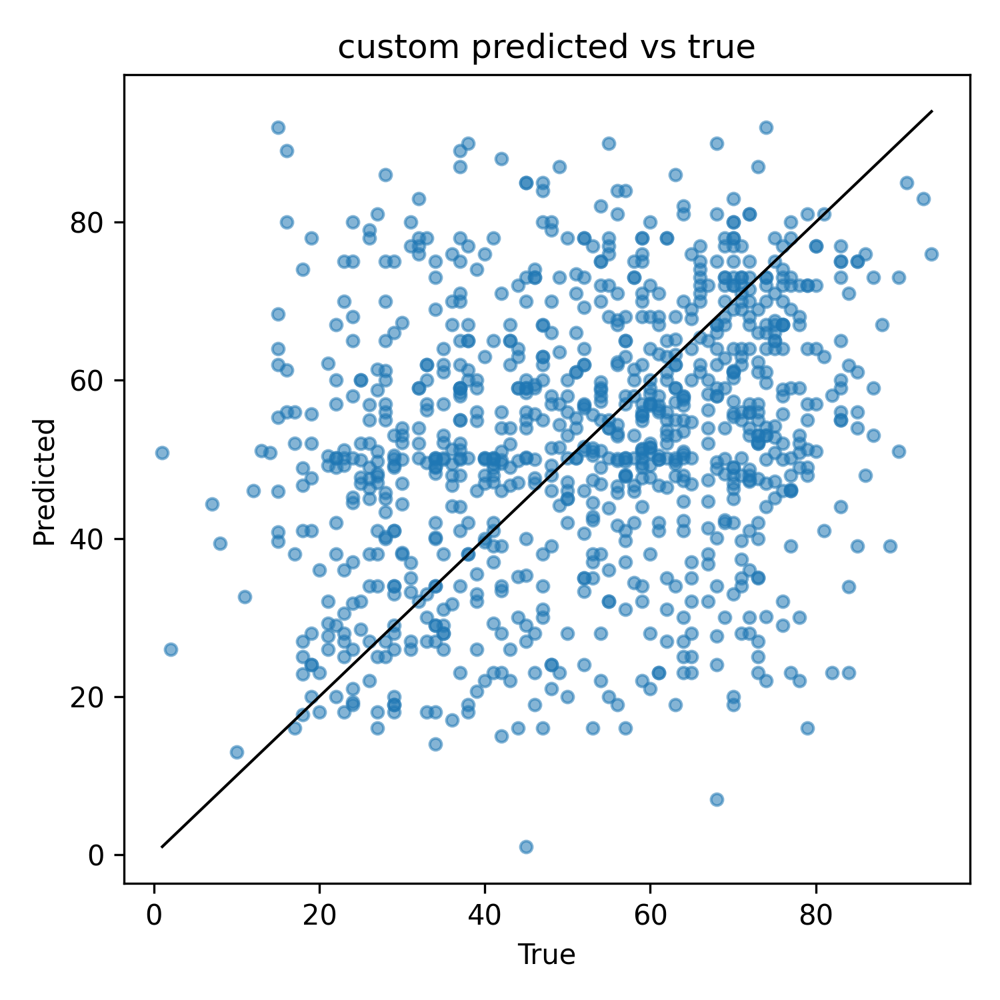

### 9.2. regression_depth_3

| model | task | parameters | mse | rmse | mae | r2 | fit_time | predict_time | depth | leaves | node_count |
| --- | --- | --- | --- | --- | --- | --- | --- | --- | --- | --- | --- |
| custom | regression | {"criterion": "squared_error", "max_depth": 3, "min_samples_split": 2, "min_samples_leaf": 1, "min_impurity_decrease": 0.0, "ccp_alpha": 0.0, "random_state": 42} | 317.629 | 17.8221 | 14.9604 | 0.124914 | 0.185417 | 0.0299725 | 3 | 8 | 15 |
| sklearn | regression | {"criterion": "squared_error", "max_depth": 3, "min_samples_split": 2, "min_samples_leaf": 1, "min_impurity_decrease": 0.0, "ccp_alpha": 0.0, "random_state": 42} | 316.14 | 17.7803 | 14.9415 | 0.129016 | 0.0204253 | 0.00639594 | 3 | 8 | 15 |

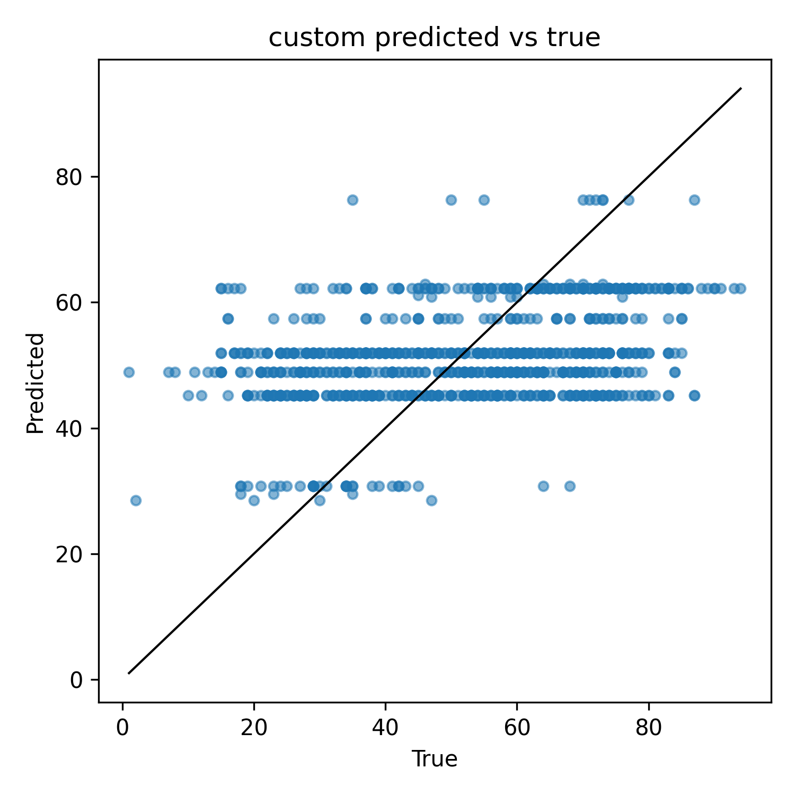

### 9.3. regression_depth_7

| model | task | parameters | mse | rmse | mae | r2 | fit_time | predict_time | depth | leaves | node_count |
| --- | --- | --- | --- | --- | --- | --- | --- | --- | --- | --- | --- |
| custom | regression | {"criterion": "squared_error", "max_depth": 7, "min_samples_split": 2, "min_samples_leaf": 1, "min_impurity_decrease": 0.0, "ccp_alpha": 0.0, "random_state": 42} | 328.361 | 18.1207 | 14.8462 | 0.0953472 | 0.900964 | 0.0439681 | 7 | 91 | 181 |
| sklearn | regression | {"criterion": "squared_error", "max_depth": 7, "min_samples_split": 2, "min_samples_leaf": 1, "min_impurity_decrease": 0.0, "ccp_alpha": 0.0, "random_state": 42} | 476.326 | 21.8249 | 15.1889 | -0.312307 | 0.0218339 | 0.00639297 | 7 | 78 | 155 |

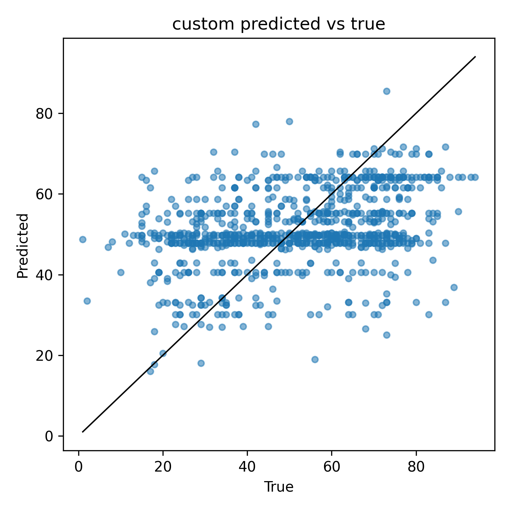

### 9.4. regression_pruned

| model | task | parameters | mse | rmse | mae | r2 | fit_time | predict_time | depth | leaves | node_count |
| --- | --- | --- | --- | --- | --- | --- | --- | --- | --- | --- | --- |
| custom | regression | {"criterion": "squared_error", "max_depth": 12, "min_samples_split": 2, "min_samples_leaf": 1, "min_impurity_decrease": 0.0, "ccp_alpha": 35033.781116087324, "random_state": 42} | 326.323 | 18.0644 | 15.2995 | 0.100962 | 7.16387 | 0.024949 | 6 | 8 | 15 |
| sklearn | regression | {"criterion": "squared_error", "max_depth": 12, "min_samples_split": 2, "min_samples_leaf": 1, "min_impurity_decrease": 0.0, "ccp_alpha": 18.857975920360147, "random_state": 42} | 328.698 | 18.13 | 15.4499 | 0.094419 | 0.0275795 | 0.00663118 | 1 | 2 | 3 |

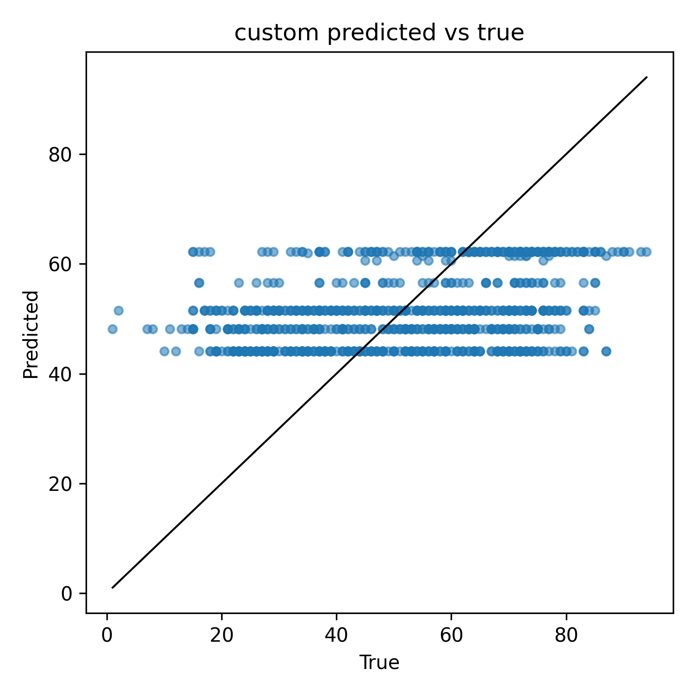

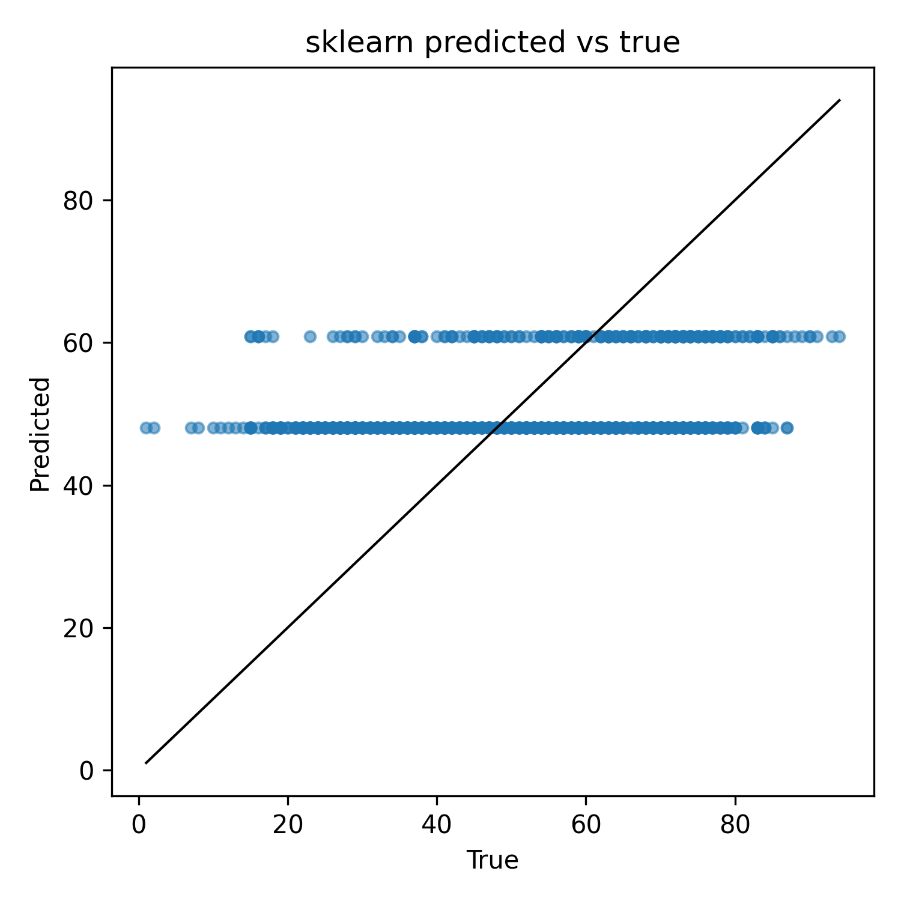

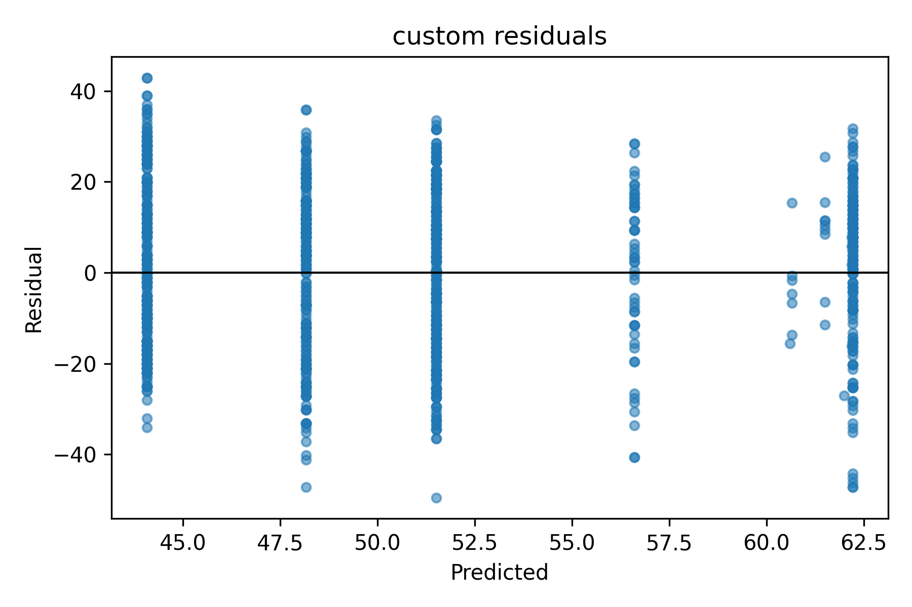

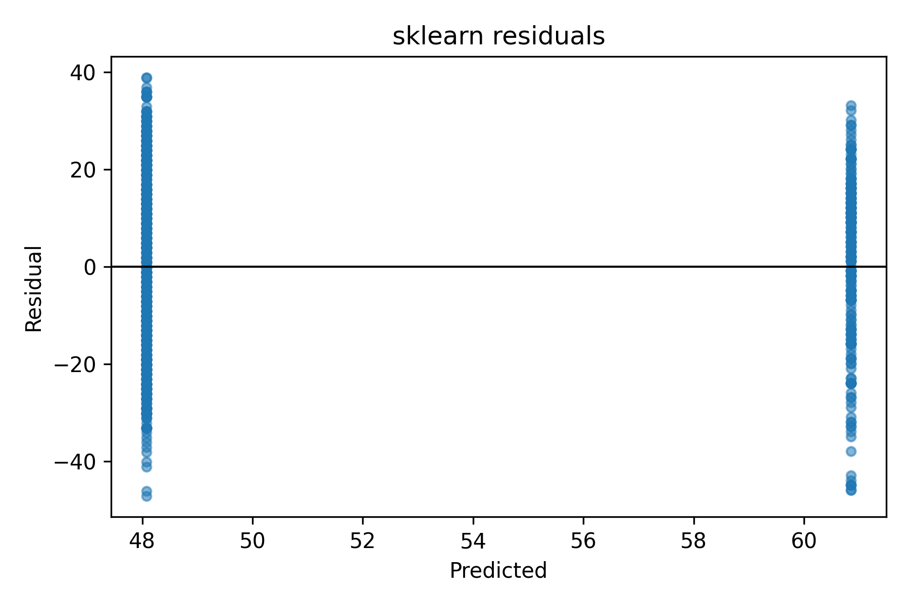

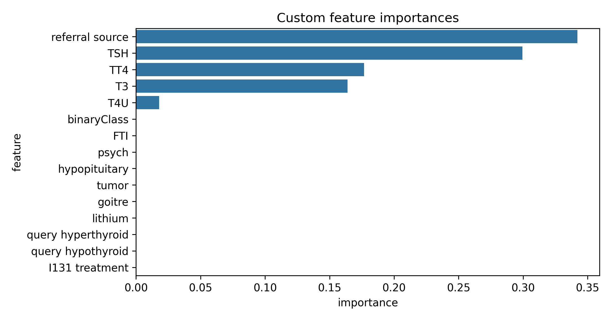

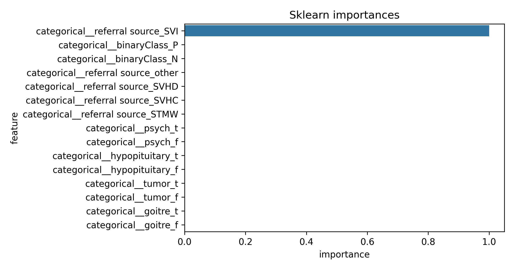

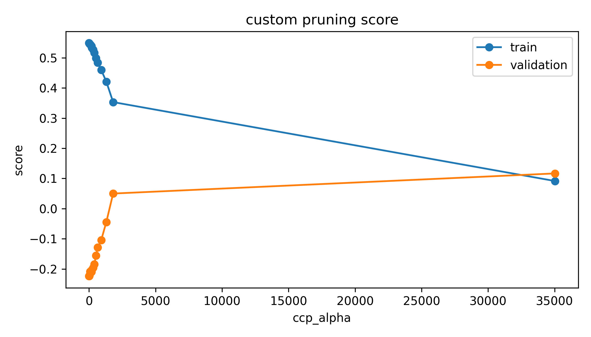

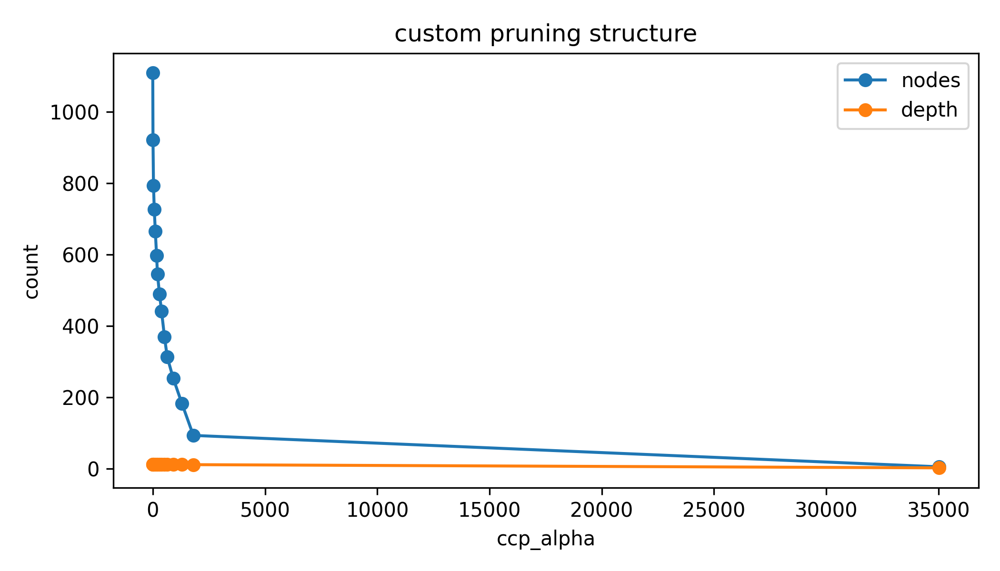

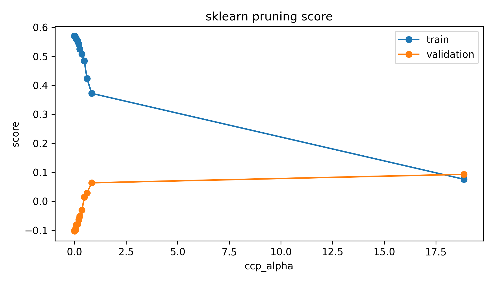

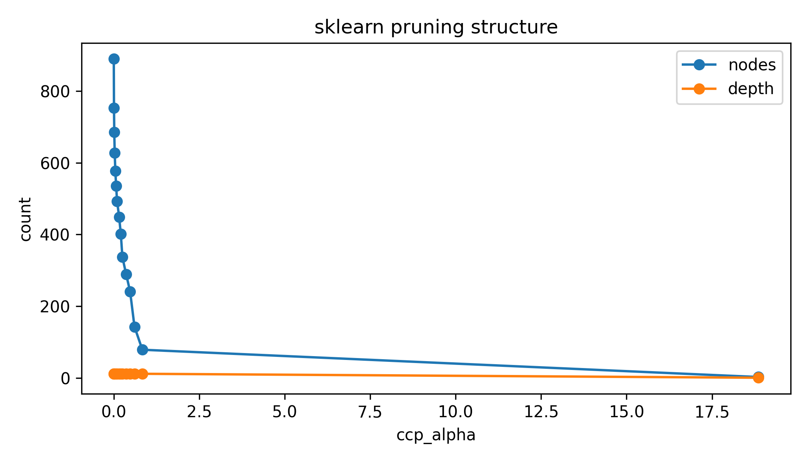

#### Sklearn model's tree visualization.

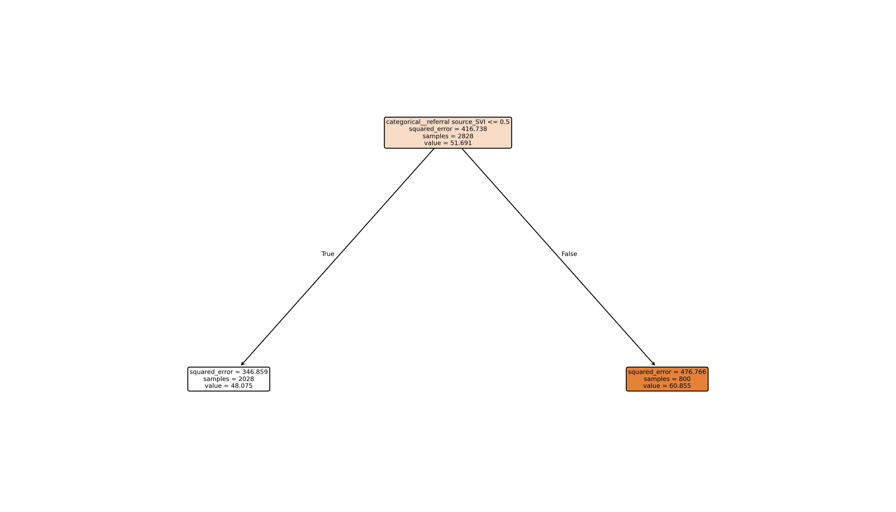

## 10. Сравнение с sklearn

Сравнение проводится по качеству, времени обучения, времени предсказания, глубине дерева, числу листьев и числу узлов. Для sklearn используется `ColumnTransformer`, так как библиотечные деревья не работают напрямую со смешанными категориальными признаками и пропусками.

## 11. Выводы

Собственная реализация покрывает основные требования лабораторной работы: ID3-подобный greedy split selection, нативные категориальные признаки, обработку пропусков через вероятностную маршрутизацию, задачи классификации и регрессии, а также post-pruning через `ccp_alpha`.

Главное упрощение — категориальные признаки разбиваются one-vs-rest, а подбор `ccp_alpha` выполняется через hold-out validation вместо K-fold CV.
