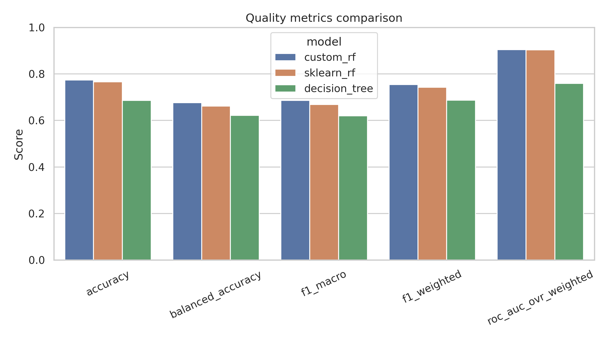
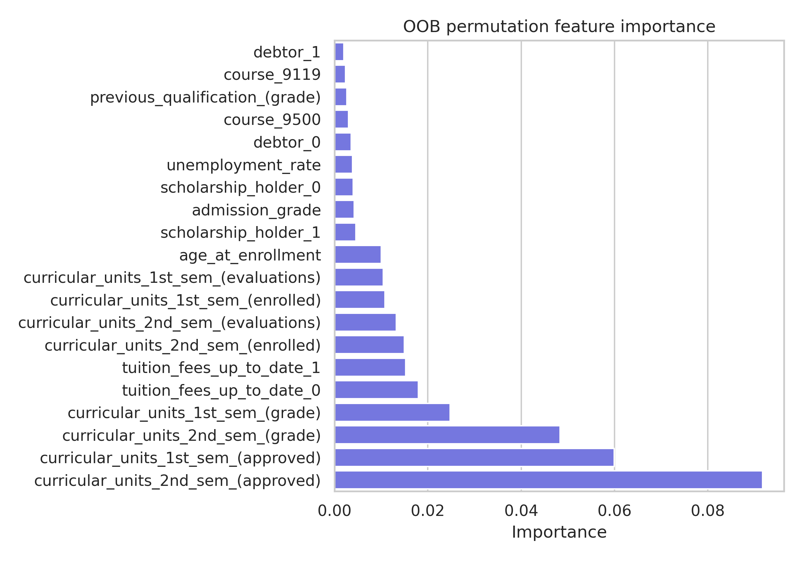
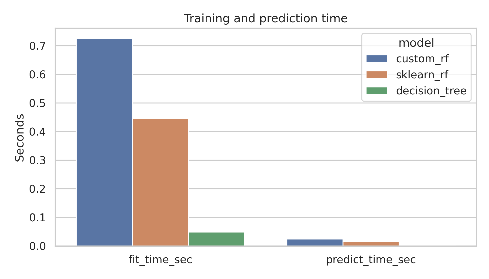

# Лабораторная работа №2. Ансамбли моделей

## 1. Цель работы

Цель работы — реализовать собственный `Random Forest` для задачи многоклассовой классификации и сравнить его с эталонной реализацией `scikit-learn`.

Проект реализует ансамбль над библиотечными деревьями `sklearn.tree.DecisionTreeClassifier`: bootstrap-выборки, случайные подмножества признаков в split, агрегацию вероятностей, OOB-оценку, подбор гиперпараметров по OOB и OOB permutation feature importance.

## 2. Задание

```md
# Лабораторная работа №2. Ансамбли моделей

В рамках лабораторной работы предстоит реализовать метод случайных подпространств (RSM) или Random Forest.

В качестве базовых алгоритмов рекомендуется использовать библиотечные реализации.

## Задание

1. Выбрать датасет для анализа;
2. Реализовать метод случайных подпространств (RSM) или Random Forest;
3. Обучить ансамбль, подобрать оптимальные гипер-параметры. Для подбора оптимальных параметров использовать grid search из sklearn; Оптимальные параметры подбирать по OOB;
4. Получить оценку важности признаков через OOB^j
5. Сравнить результаты с эталонными реализациями из библиотеки scikit-learn:
    * точность модели;
    * время обучения;
6. Подготовить отчет, включающий:
    * описание выбранного метода;
    * описание датасета;
    * результаты экспериментов;
    * сравнение с эталонными реализациями;
    * выводы.
```

Выполнение: датасет выбран, собственный `MyRandomForestClassifier` реализован, гиперпараметры подбираются через `sklearn.model_selection.ParameterGrid` по `oob_score_`, важность признаков считается OOB-перемешиванием, результаты сравниваются с `sklearn.ensemble.RandomForestClassifier`.

## 3. Датасет

Используется UCI dataset `Predict Students' Dropout and Academic Success`:

<https://archive.ics.uci.edu/dataset/697/predict+students+dropout+and+academic+success>

Задача — предсказать академический статус студента по признакам поступления, демографии, социально-экономическим и академическим признакам.

- Объектов: около 4424.
- Исходных признаков: около 36.
- Целевая переменная: `Target`.
- Классы: `Dropout`, `Enrolled`, `Graduate`.
- Разбиение: 80% train / 20% test со стратификацией.

## 4. Предобработка данных

Модуль `src/preprocess.py`:

- скачивает zip-файл UCI в `data/raw/`;
- распаковывает и читает CSV с разделителем `;`;
- нормализует имена колонок;
- кодирует целевую переменную через `LabelEncoder`;
- делает стратифицированный `train_test_split`;
- кодирует категориальные признаки через `OneHotEncoder(handle_unknown="ignore")`;
- числовые признаки передает без масштабирования;
- сохраняет подготовленные матрицы в `data/processed/`.

Масштабирование не используется, потому что модели на решающих деревьях не требуют стандартизации признаков.

## 5. Теоретическая часть

### 5.1. Идея ансамбля

Ансамбль объединяет несколько базовых моделей, чтобы получить более устойчивое предсказание. В Random Forest базовые модели — решающие деревья.

### 5.2. Bagging

Для каждого дерева строится bootstrap-выборка: объекты выбираются из train set с возвращением. Разные деревья видят разные обучающие подвыборки, поэтому их ошибки частично декоррелируются.

### 5.3. Random Forest

Random Forest добавляет к bagging случайный выбор признаков в каждой вершине дерева. В реализации это делается через параметр `max_features`, передаваемый в `DecisionTreeClassifier`.

Предсказание класса выполняется через усреднение вероятностей:

```text
P(y = c | x) = (1 / T) * sum_t P_t(y = c | x)
```

Итоговый класс выбирается как `argmax` по усредненным вероятностям.

### 5.4. Out-of-bag оценка

Для каждого дерева часть объектов не попадает в bootstrap-выборку. Эти объекты являются OOB-объектами для дерева. Для каждого train-объекта агрегируются предсказания только тех деревьев, где объект был OOB. `oob_score_` считается как accuracy по объектам, у которых есть хотя бы одно OOB-предсказание.

### 5.5. OOB feature importance

Для каждого дерева и каждого признака:

1. берутся OOB-объекты дерева;
2. считается baseline OOB error;
3. значения одного признака перемешиваются;
4. считается новый OOB error;
5. важность признака равна среднему росту ошибки.

В проекте важность считается для transformed feature columns, то есть для колонок после one-hot encoding.

## 6. Реализация

Основные файлы:

- `src/random_forest.py` — `MyRandomForestClassifier`;
- `src/preprocess.py` — загрузка и подготовка UCI dataset;
- `src/experiments/tuning.py` — OOB grid search через `ParameterGrid`;
- `src/experiments/sklearn_baselines.py` — sklearn baselines;
- `src/experiments/runner.py` — запуск эксперимента и сохранение артефактов;
- `src/visualization.py` — графики;
- `src/metrics.py` — метрики и таблицы.

Собственная модель не использует `sklearn.ensemble.RandomForestClassifier`; внутри нее используются только базовые деревья `DecisionTreeClassifier`.

## 7. Эксперименты

Конфиги находятся в `configs/`:

- `rf_default.yaml` — базовый Random Forest;
- `rf_shallow.yaml` — ограничение глубины деревьев;
- `rf_many_trees.yaml` — большее число деревьев;
- `rf_oob_grid_search.yaml` — подбор гиперпараметров по OOB;
- `rf_best.yaml` — финальная модель с лучшими найденными параметрами, если они уже сохранены.

Каждый запуск сохраняет результаты в:

```text
results/experiments/<experiment_name>/
```

Основные артефакты:

- `metrics.csv`, `metrics.md`;
- `params.json`;
- `custom/impurity_feature_importance.csv`;
- `custom/oob_permutation_feature_importance.csv`;
- `sklearn/impurity_feature_importance.csv`;
- `figures/confusion_matrix_custom_rf.png`;
- `figures/confusion_matrix_sklearn_rf.png`;
- `figures/metrics_comparison.png`;
- `figures/timing_comparison.png`;
- `figures/oob_score_comparison.png`;

Примеры графиков после запуска [дефолтного пресета](configs/rf_default.yaml):







## 8. Подбор гиперпараметров по OOB

Grid search реализован в `src/experiments/tuning.py`. Используется `ParameterGrid`, каждая конфигурация обучается с `bootstrap=True` и `oob_score=True`, затем выбирается максимальный `oob_score_`.

В выполненном запуске лучшие параметры для custom RF и sklearn RF совпали:

```json
{
  "n_estimators": 200,
  "criterion": "gini",
  "max_depth": 12,
  "min_samples_split": 2,
  "min_samples_leaf": 1,
  "max_features": 0.5,
  "bootstrap": true,
  "max_samples": null,
  "oob_score": true,
  "class_weight": null,
  "n_jobs": null
}
```

Для `rf_oob_grid_search` сохраняются:

- `grid_search_results_custom.csv`;
- `grid_search_results_sklearn.csv`;
- `best_params_custom.json`;
- `best_params_sklearn.json`;
- `figures/custom_grid_search_heatmap.png`;
- `figures/sklearn_grid_search_heatmap.png`;
- `figures/custom_grid_oob_score_vs_n_estimators.png`;
- `figures/sklearn_grid_oob_score_vs_n_estimators.png`.

## 9. Сравнение с sklearn

Сравниваются:

- `custom_rf` — собственная реализация Random Forest;
- `sklearn_rf` — `sklearn.ensemble.RandomForestClassifier`;
- `decision_tree` — одиночное дерево для дополнительного контраста.

Метрики:

- accuracy;
- balanced accuracy;
- precision/recall/F1 macro;
- precision/recall/F1 weighted;
- ROC-AUC OVR weighted;
- fit time;
- predict time;
- OOB score;
- средняя глубина деревьев;
- среднее число листьев.

После запуска конкретные значения находятся в `results/experiments/<experiment_name>/metrics.md`.

Краткая сводка выполненного запуска:

| experiment | model | accuracy | f1_macro | roc_auc_ovr_weighted | fit_time_sec | oob_score |
| --- | --- | --- | --- | --- | --- | --- |
| rf_default | custom_rf | 0.7740 | 0.6866 | 0.9045 | 0.9417 | 0.7652 |
| rf_default | sklearn_rf | 0.7661 | 0.6684 | 0.9034 | 0.5684 | 0.7700 |
| rf_shallow | custom_rf | 0.7537 | 0.5921 | 0.9006 | 0.6979 | 0.7454 |
| rf_shallow | sklearn_rf | 0.7503 | 0.5624 | 0.8979 | 0.3432 | 0.7482 |
| rf_many_trees | custom_rf | 0.7706 | 0.6788 | 0.9065 | 2.7747 | 0.7751 |
| rf_many_trees | sklearn_rf | 0.7684 | 0.6724 | 0.9067 | 1.7673 | 0.7725 |
| rf_best | custom_rf | 0.7706 | 0.7040 | 0.9003 | 5.0142 | 0.7793 |
| rf_best | sklearn_rf | 0.7684 | 0.7003 | 0.9012 | 3.2612 | 0.7779 |

## 10. Как запустить

Установка зависимостей:

```bash
uv sync
```

Запуск одного эксперимента:

```bash
uv run python -m src.experiments.cli --config configs/rf_default.yaml
```

Запуск всех экспериментов:

```bash
uv run python -m src.experiments.cli --run-all
```

Форматирование и линтинг:

```bash
uv run ruff format .
uv run ruff check .
```

## 11. Выводы

Random Forest снижает дисперсию одиночного дерева за счет bootstrap-усреднения и случайного выбора признаков в split. OOB-оценка позволяет использовать train set для внутренней оценки качества без отдельной cross-validation процедуры. OOB permutation importance показывает, какие transformed features сильнее всего влияют на качество модели.

Собственная реализация близка к sklearn по качеству, но медленнее по времени обучения и расчета OOB permutation importance, так как код написан в учебном стиле и не использует внутренние оптимизации sklearn forest.
