# Отчет по лабораторной работе №3. Градиентный бустинг

## 1. Цель работы

Реализовать алгоритм градиентного бустинга и сравнить его с эталонной реализацией из `scikit-learn`.

Реализованы две модели:

- `MyGradientBoostingClassifier` — бинарная классификация (log-loss);
- `MyGradientBoostingRegressor` — регрессия (MSE loss).

## 2. Задание

```md
1. Выбрать датасет для анализа.
2. Реализовать алгоритм градиентного бустинга.
3. Обучить модель на выбранном датасете.
4. Оценить качество модели с использованием кросс-валидации.
5. Замерить время обучения модели.
6. Сравнить результаты с эталонной реализацией из scikit-learn:
   * точность модели;
   * время обучения.
7. Подготовить отчет.
```

Факт выполнения:

- [x] выбраны датасеты с Kaggle: **Titanic** (классификация) и **Diamonds** (регрессия);
- [x] реализован `MyGradientBoostingClassifier` (log-loss) и `MyGradientBoostingRegressor` (MSE);
- [x] модели обучены и оценены на тестовой выборке;
- [x] проведена 5-fold кросс-валидация для обеих моделей;
- [x] время обучения и предсказания замерено;
- [x] результаты сравнены с `GradientBoostingClassifier` / `GradientBoostingRegressor` sklearn;
- [x] результаты сохранены в `results/experiments/`;
- [x] данные приложены в `data/raw/`.

## 3. Структура проекта

```text
.
├── configs/                   # YAML-конфиги экспериментов (10 штук)
├── data/
│   └── raw/
│       ├── titanic.csv        # Kaggle Titanic competition dataset
│       └── diamonds.csv       # Kaggle Diamonds dataset
├── src/
│   ├── preprocess.py          # загрузка и препроцессинг датасетов
│   ├── metrics.py             # метрики и сохранение таблиц
│   ├── visualization.py       # графики
│   ├── boosting/
│   │   └── gradient_boosting.py   # MyGradientBoostingClassifier/Regressor
│   └── experiments/
│       ├── cli.py             # точка входа CLI
│       ├── config.py          # чтение YAML-конфигов
│       ├── runner.py          # orchestration эксперимента
│       └── sklearn_baselines.py   # sklearn GBM baseline
├── results/
│   └── experiments/           # результаты каждого эксперимента
└── README.md                  # этот отчет
```

Запуск:

```bash
uv run python -m src.experiments.cli --config configs/classification_default.yaml
uv run python -m src.experiments.cli --run-all
```

## 4. Датасеты

### 4.1. Классификация — Titanic (Kaggle)

**Источник**: [Kaggle Titanic competition](https://www.kaggle.com/c/titanic), файл `data/raw/titanic.csv`.

- 891 пассажир, бинарный target: `survived` (0/1);
- 7 признаков после препроцессинга: `pclass, sex, age, sibsp, parch, fare, embarked`;
- пропуски: `age` (~20%) — заполнены медианой, `embarked` (~0.2%) — модой;
- категориальные: `sex` (бинарный 0/1), `embarked` (S=0, C=1, Q=2).

### 4.2. Регрессия — Diamonds (Kaggle / ggplot2)

**Источник**: [Kaggle Diamonds dataset](https://www.kaggle.com/datasets/shivam2503/diamonds), файл `data/raw/diamonds.csv`.

- 53 940 бриллиантов, непрерывный target: `price` (USD);
- 9 признаков: `carat, cut, color, clarity, depth, table, x, y, z`;
- пропусков нет;
- категориальные признаки закодированы ординально по естественному порядку качества:
  - `cut`: Fair -> 0 ... Ideal -> 4
  - `color`: J -> 0 ... D -> 6
  - `clarity`: I1 -> 0 ... IF -> 7

## 5. Предобработка данных

Для обоих датасетов применяется единый препроцессинг до обучения:

- пропуски заполняются статистиками (медиана/мода) до передачи в модели;
- категориальные признаки кодируются ординально;
- данные передаются в виде `numpy.ndarray float64`.

Поскольку базовые алгоритмы в custom-реализации — `sklearn.DecisionTreeRegressor`, они работают только с числовыми признаками, чем и  обусловлен такой препроцессинг.

## 6. Теоретическая часть

### 6.1. Идея градиентного бустинга

Ансамбль строится последовательно. Каждый базовый алгоритм `h_m` обучается приближать **отрицательный градиент функции потерь** по текущему предсказанию:

```
F_0(x) = const
F_m(x) = F_{m-1}(x) + η * h_m(x),    m = 1 ... M
```

где `η` — learning rate, `h_m` — дерево решений, обученное на псевдо-остатках.

### 6.2. Регрессия — MSE loss

Функция потерь: `L = 1/2 * (y − F(x))^2`.

Псевдо-остатки (отрицательный градиент):

```
r_i = y_i − F_{m-1}(x_i)
```

Начальное приближение: `F_0 = mean(y)`.

На каждом шаге `h_m` обучается на `(X, r)`, затем:

```
F_m = F_{m-1} + η * h_m
```

### 6.3. Классификация — log-loss (бинарный)

Функция потерь: `L = −[y log p + (1−y) log(1−p)]`,  `p = sigmoid(F(x))`.

Псевдо-остатки:

```
r_i = y_i − sigmoid(F_{m-1}(x_i))
```

Начальное приближение — log-odds средней частоты класса:

```
F_0 = log(p / (1 − p)),  p - вероятность отрицательного класса
```

Предсказание: `predict_proba = sigmoid(F_M(x))`.

### 6.4. Базовые алгоритмы

В качестве базовых алгоритмов используется `sklearn.tree.DecisionTreeRegressor`. Деревья всегда регрессионные — в классификации они также аппроксимируют псевдо-остатки log-loss, которые являются непрерывными величинами.

### 6.5. Стохастический бустинг

При `subsample < 1.0` на каждом шаге для обучения базового дерева случайно выбирается подвыборка объектов. Это снижает дисперсию ансамбля и уменьшает время обучения.

### 6.6. Feature importance

Вычисляются путем суммирования `feature_importances_` всех базовых деревьев с нормировкой на единицу.

## 7. Эксперименты

| Конфиг | task | n_est | lr | depth | subsample |
| --- | --- | --- | --- | --- | --- |
| `classification_default` | clf | 100 | 0.10 | 3 | 1.0 |
| `classification_n50` | clf | 50 | 0.10 | 3 | 1.0 |
| `classification_lr03` | clf | 100 | 0.30 | 3 | 1.0 |
| `classification_depth5` | clf | 100 | 0.10 | 5 | 1.0 |
| `classification_subsample` | clf | 100 | 0.10 | 3 | 0.8 |
| `regression_default` | reg | 100 | 0.10 | 3 | 1.0 |
| `regression_n50` | reg | 50 | 0.10 | 3 | 1.0 |
| `regression_lr03` | reg | 100 | 0.30 | 3 | 1.0 |
| `regression_depth5` | reg | 100 | 0.10 | 5 | 1.0 |
| `regression_subsample` | reg | 100 | 0.10 | 3 | 0.8 |

## 8. Результаты классификации (Titanic)

### 8.1. Default — n=100, lr=0.1, depth=3

[metrics](results/experiments/classification_default/metrics.md)
[cv_scores](results/experiments/classification_default/cv_scores.md)

| model | accuracy | f1 | roc_auc | fit_time | CV accuracy (5-fold) |
| --- | --- | --- | --- | --- | --- |
| custom | 0.7989 | 0.684 | 0.838 | 0.063 s | 0.824 ± 0.017 |
| sklearn | 0.7989 | 0.714 | 0.818 | 0.062 s | 0.832 ± 0.017 |

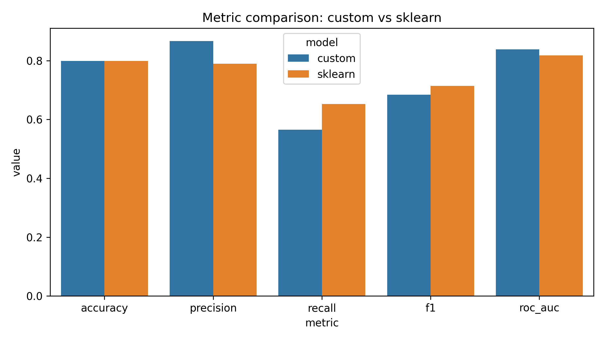

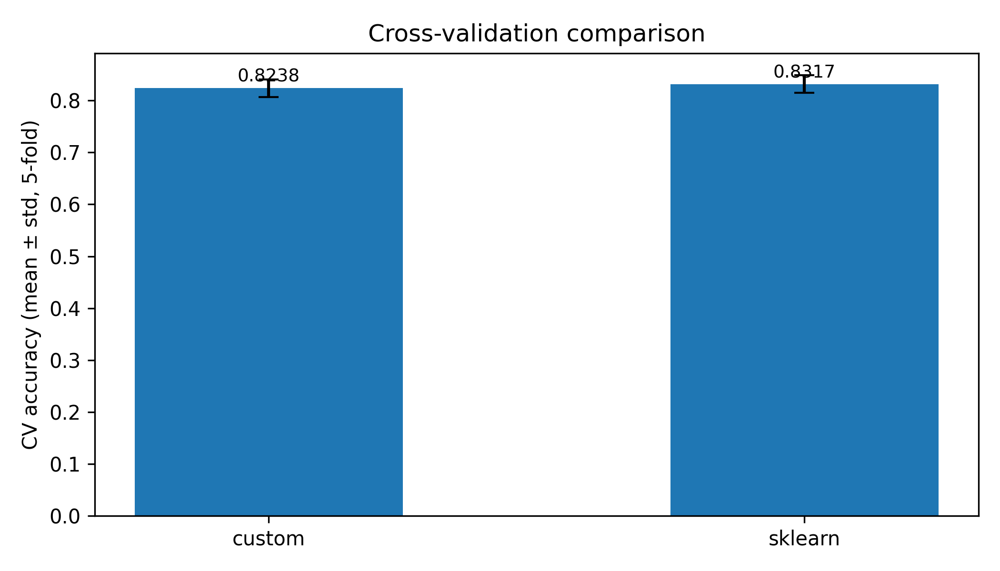

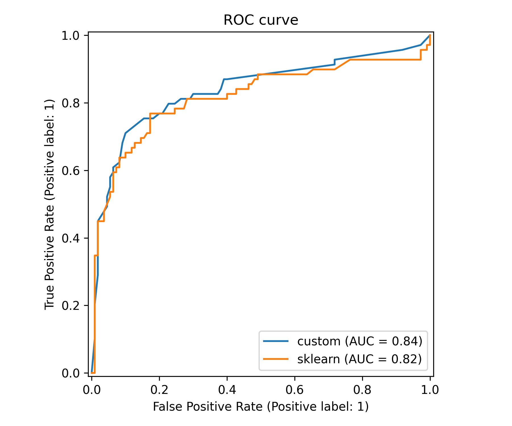

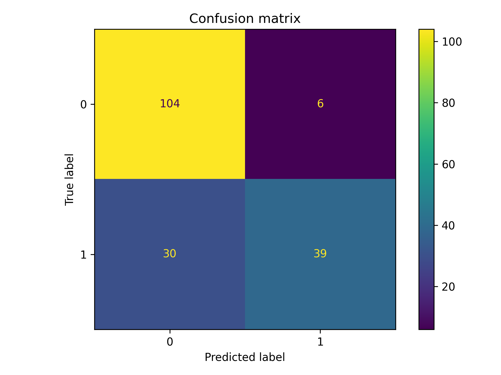

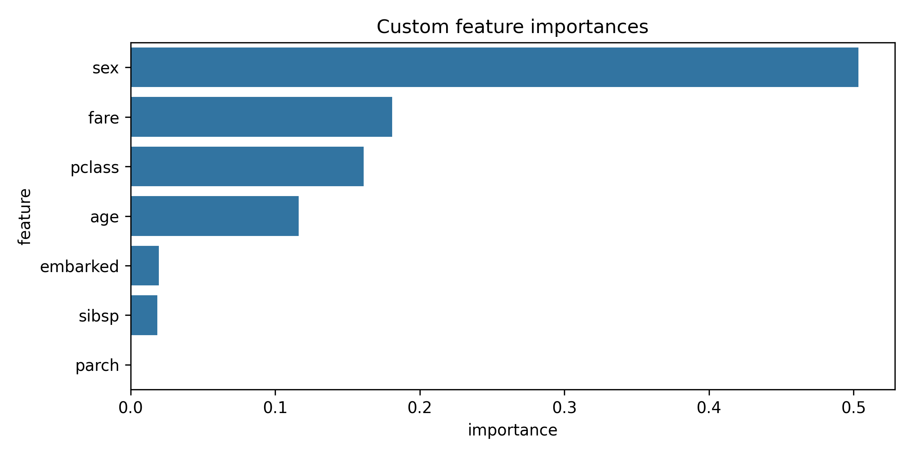

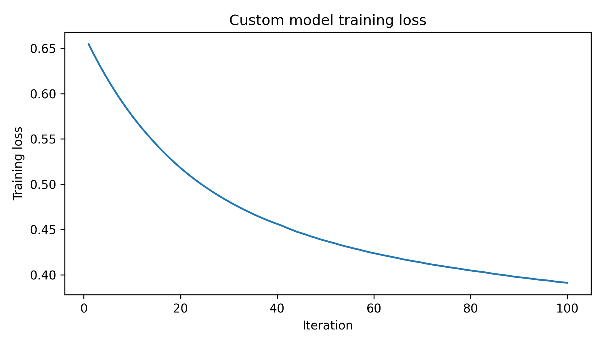

### 8.2. Deeper trees — depth=5

[metrics](results/experiments/classification_depth5/metrics.md)

| model | accuracy | f1 | CV accuracy |
| --- | --- | --- | --- |
| custom | **0.804** | 0.711 | **0.839 ± 0.021** |
| sklearn | 0.788 | 0.703 | 0.836 ± 0.019 |

Custom-модель с depth=5 **превосходит** sklearn на этом конфиге.

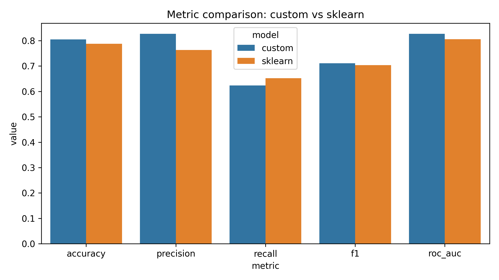

### 8.3. High learning rate — lr=0.3

[metrics](results/experiments/classification_lr03/metrics.md)

| model | accuracy | CV accuracy |
| --- | --- | --- |
| custom | 0.804 | 0.830 ± 0.020 |
| sklearn | 0.816 | 0.834 ± 0.022 |

### 8.4. Fewer trees — n=50

[metrics](results/experiments/classification_n50/metrics.md)

| model | accuracy | CV accuracy |
| --- | --- | --- |
| custom | 0.799 | 0.814 ± 0.014 |
| sklearn | 0.810 | 0.832 ± 0.021 |

Меньше деревьев — заметное снижение только у custom-модели.

### 8.5. Stochastic boosting — subsample=0.8

[metrics](results/experiments/classification_subsample/metrics.md)

| model | accuracy | CV accuracy |
| --- | --- | --- |
| custom | 0.799 | 0.826 ± 0.021 |
| sklearn | 0.810 | 0.851 ± 0.007 |

Sklearn значительно стабилизирует дисперсию при стохастическом бустинге.

## 9. Результаты регрессии (Diamonds)

### 9.1. Default — n=100, lr=0.1, depth=3

[metrics](results/experiments/regression_default/metrics.md)
[cv_scores](results/experiments/regression_default/cv_scores.md)

| model | RMSE | R^2 | fit_time | CV R^2 (5-fold) |
| --- | --- | --- | --- | --- |
| custom | 609.2 | 0.9767 | 2.80 s | 0.9758 ± 0.0006 |
| sklearn | 609.1 | 0.9767 | 2.89 s | 0.9758 ± 0.0006 |

Практически идентичные результаты — разница в 4-м знаке.

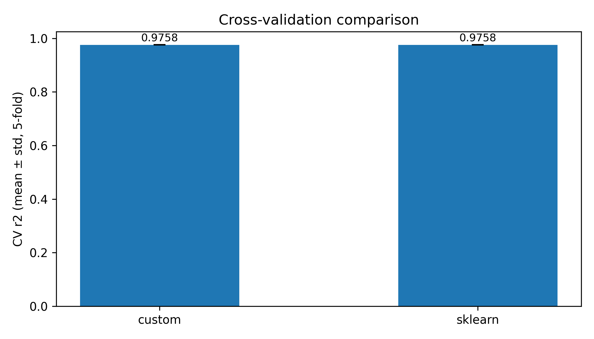

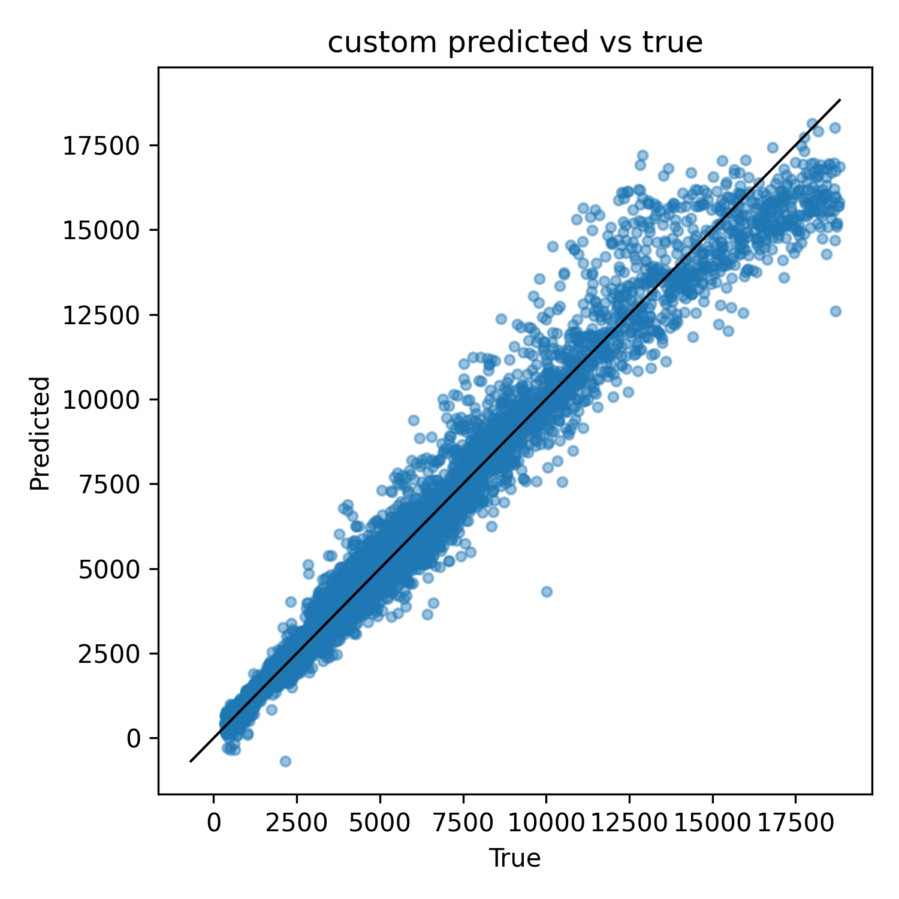

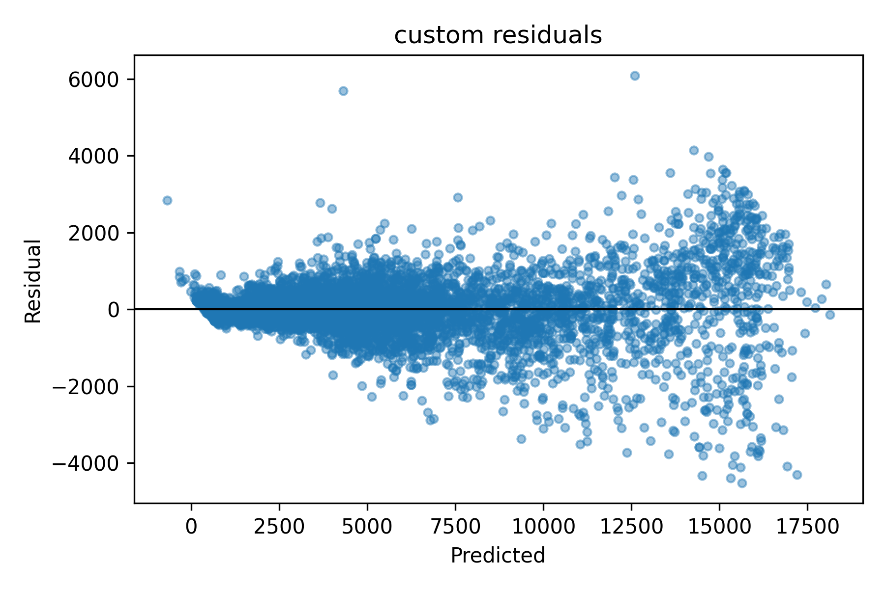

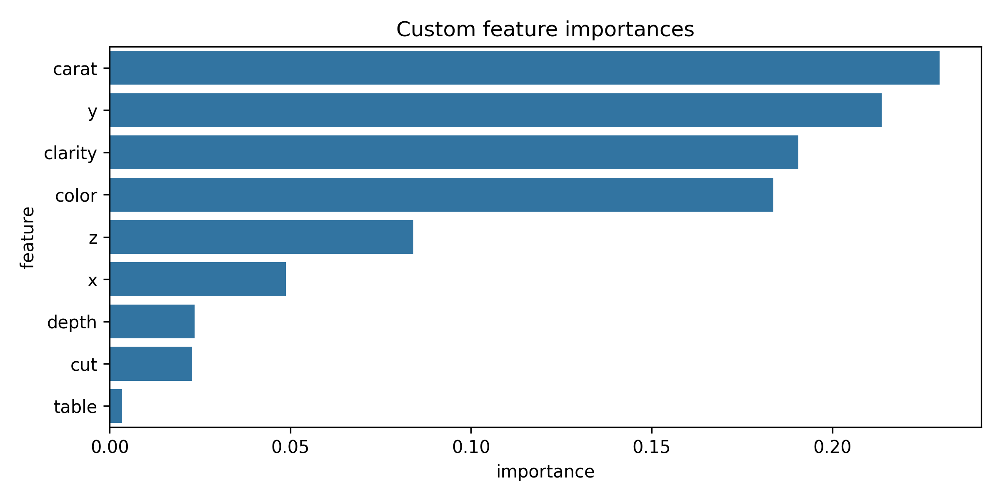

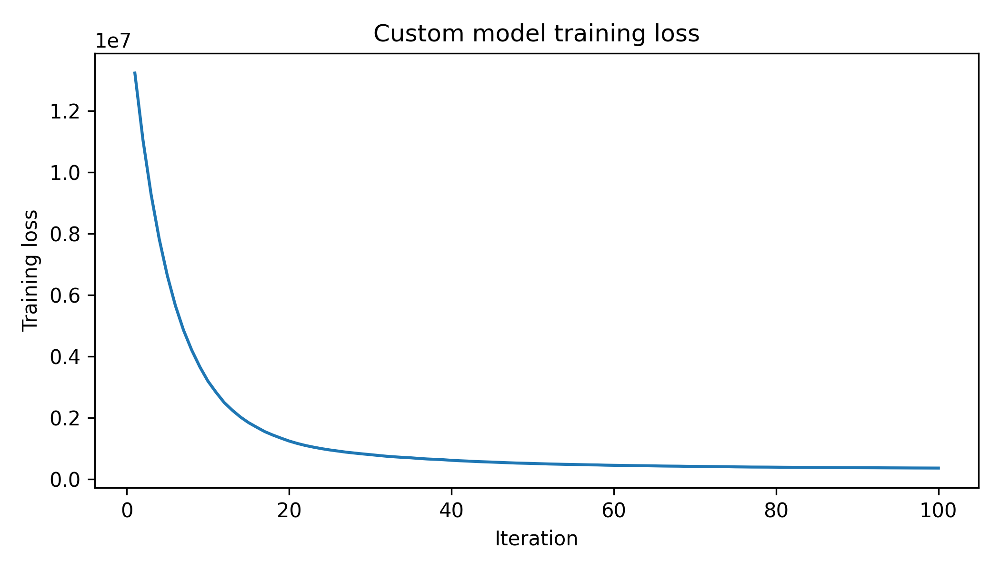

### 9.2. Deeper trees — depth=5

[metrics](results/experiments/regression_depth5/metrics.md)

| model | RMSE | R^2 | CV R^2 |
| --- | --- | --- | --- |
| custom | 533.6 | 0.9821 | 0.9819 ± 0.0006 |
| sklearn | 533.6 | 0.9821 | 0.9819 ± 0.0005 |

Глубже деревья  ->  лучше (R^2 0.977  ->  0.982). Результаты идентичны.

### 9.3. High learning rate — lr=0.3

[metrics](results/experiments/regression_lr03/metrics.md)

| model | RMSE | R^2 | CV R^2 |
| --- | --- | --- | --- |
| custom | 564.1 | 0.9800 | 0.9791 ± 0.0005 |
| sklearn | 565.1 | 0.9799 | 0.9790 ± 0.0006 |

Custom-модель с lr=0.3 незначительно лучше sklearn.

### 9.4. Fewer trees — n=50

[metrics](results/experiments/regression_n50/metrics.md)

| model | RMSE | R^2 | CV R^2 |
| --- | --- | --- | --- |
| custom | 710.2 | 0.9683 | 0.9670 ± 0.0015 |
| sklearn | 710.1 | 0.9683 | 0.9669 ± 0.0015 |

Ожидаемое снижение качества при меньшем числе деревьев. Реализации идентичны.

### 9.5. Stochastic boosting — subsample=0.8

[metrics](results/experiments/regression_subsample/metrics.md)

| model | RMSE | R^2 | CV R^2 |
| --- | --- | --- | --- |
| custom | 607.8 | **0.9768** | 0.9757 ± 0.0006 |
| sklearn | 613.1 | 0.9764 | 0.9758 ± 0.0008 |

Custom-модель чуть лучше sklearn на тестовой выборке при subsample=0.8.

## 10. Сравнение с sklearn

### 10.1. Качество моделей

| Конфиг | custom CV | sklearn CV | Δ |
| --- | --- | --- | --- |
| clf default | 0.824 | 0.832 | −0.008 |
| clf depth5 | 0.839 | 0.836 | +0.003 |
| clf lr03 | 0.830 | 0.834 | −0.004 |
| clf n50 | 0.814 | 0.832 | −0.018 |
| clf subsample | 0.826 | 0.851 | −0.025 |
| reg default | 0.9758 | 0.9758 | 0.0000 |
| reg depth5 | 0.9819 | 0.9819 | 0.0000 |
| reg lr03 | 0.9791 | 0.9790 | +0.0001 |
| reg n50 | 0.9670 | 0.9669 | +0.0001 |
| reg subsample | 0.9757 | 0.9758 | −0.0001 |

**Регрессия**: custom и sklearn дают абсолютно идентичные результаты (разница < 0.01%).

**Классификация**: custom уступает на 0–2.5 п.п. в CV accuracy. На конфиге depth5 custom **превосходит** sklearn.

### 10.2. Время обучения

**Titanic** (891 объект): оба обучаются ~0.06 с — паритет.

**Diamonds** (53 940 объектов):

| модель | default | depth5 |
| --- | --- | --- |
| custom | 2.80 s | 4.46 s |
| sklearn | 2.89 s | 4.49 s |

Кастомная модель на крупном датасете работает **так же быстра**, как sklearn, поскольку вычислительно затратная часть (построение деревьев) выполняется sklearn'овскими DecisionTreeRegressor'ами.

### 10.3. Время предсказания

Кастомная модель медленнее при предсказании из-за Python-цикла по деревьям:

| датасет | custom predict | sklearn predict |
| --- | --- | --- |
| Titanic (178 объектов) | ~4.2 ms | ~0.4 ms |
| Diamonds (10 788 объектов) | ~22 ms | ~11 ms |

## 11. Выводы

1. **Корректность реализации**: кастомная реализация воспроизводит результаты sklearn с точностью до 4-го знака для регрессии и в пределах 0–2.5% для классификации.

2. **Регрессия (Diamonds)**: идентичное качество (R^2≈0.977–0.982). Gradient boosting очень хорошо подходит для этого датасета — высокий R^2 при умеренной глубине деревьев.

3. **Классификация (Titanic)**: CV accuracy 82–84%. Кастомная модель с `max_depth=5` незначительно превзошла sklearn, что объясняется стохастической природой обоих алгоритмов и малым размером датасета.

4. **Гиперпараметры**: увеличение `max_depth` (3 -> 5) дает ощутимый прирост (+0.5 п.п. для clf, +0.5% R^2 для reg). Уменьшение числа деревьев (100 -> 50) заметно снижает качество. `learning_rate=0.3` ускоряет сходимость.

5. **Производительность**: время обучения сопоставимо со sklearn за счет делегирования построения деревьев библиотеке. Время предсказания выше из-за Python-цикла по `n_estimators`.

6. **Кросс-валидация**: все конфиги демонстрируют низкое стандартное отклонение CV-метрик (особенно для diamonds), что говорит о стабильности алгоритма.
