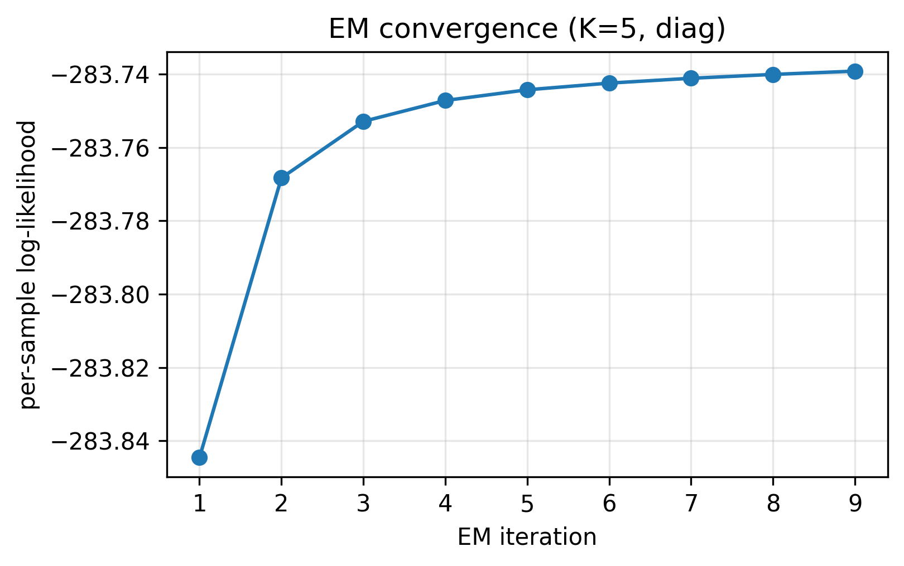
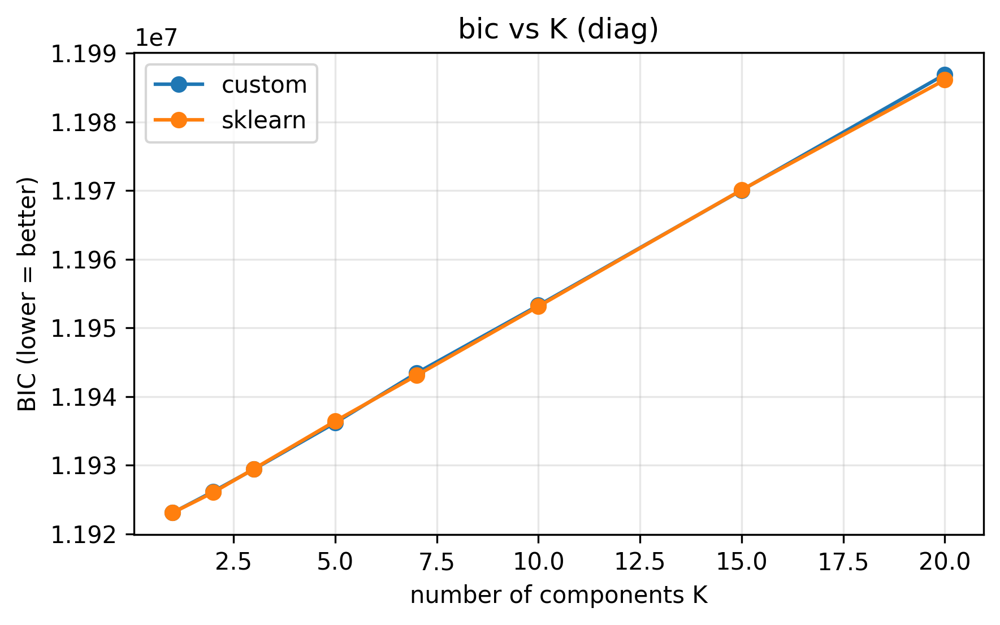
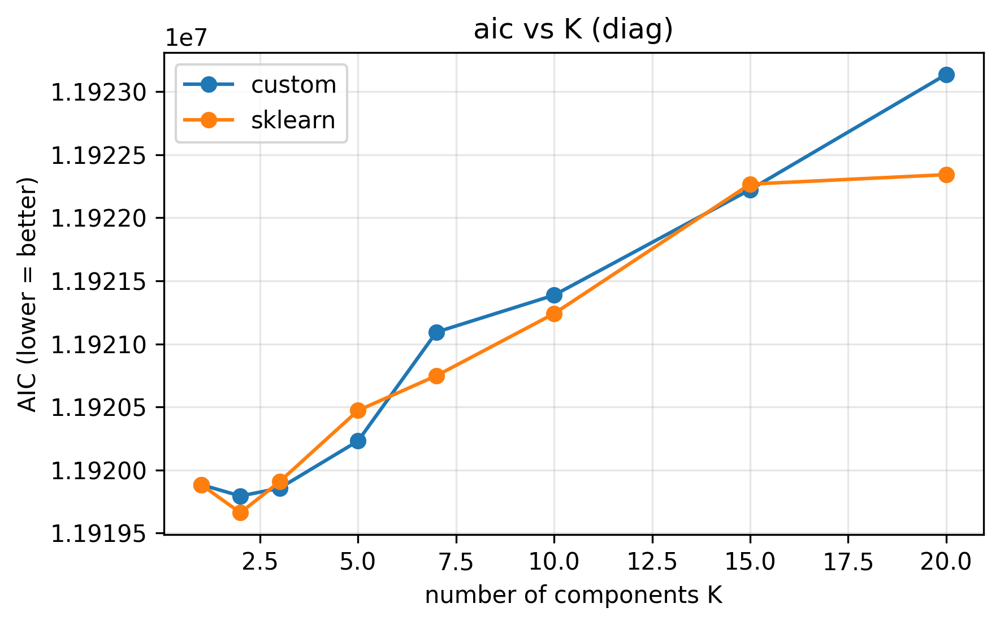
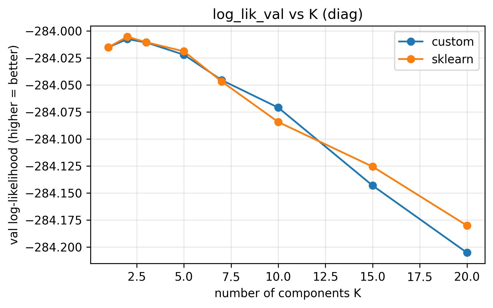
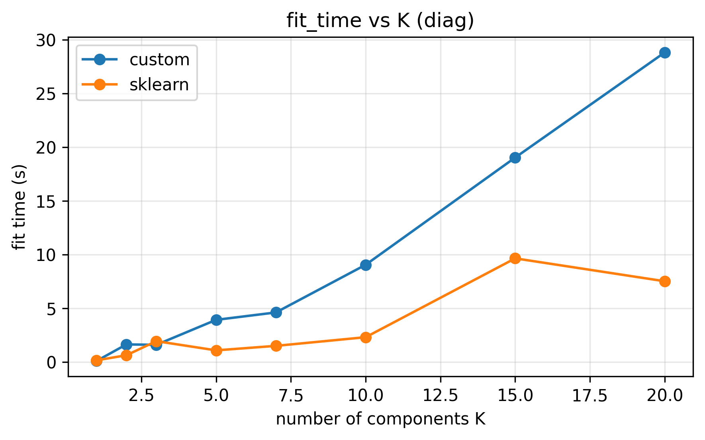
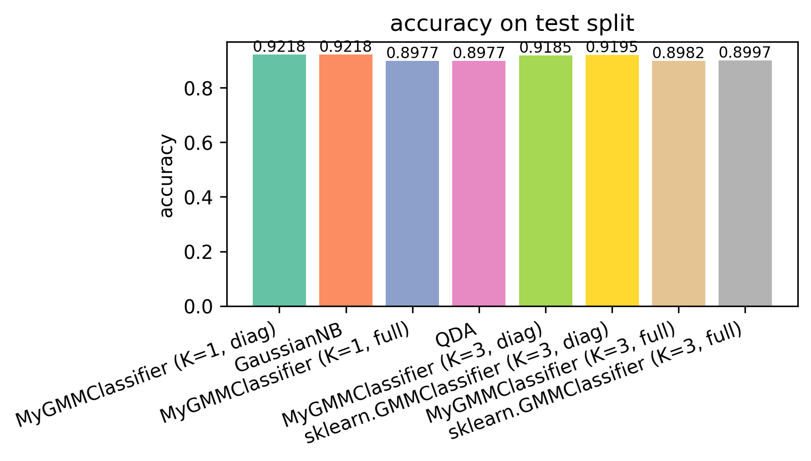
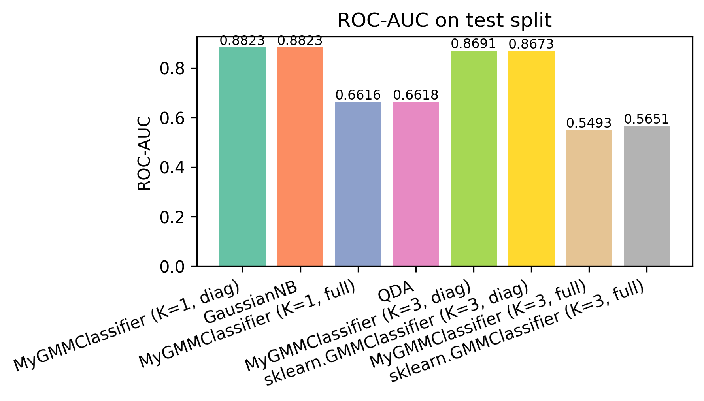

# Лабораторная работа №4. EM-алгоритм и Gaussian Mixture Model

## 1. Цель работы

Реализовать собственную модель Gaussian Mixture Model, обучаемую EM-алгоритмом, и сравнить её с эталонной реализацией `sklearn.mixture.GaussianMixture`. Дополнительно сравнить кастомный GMM-классификатор с `GaussianNB` и `QuadraticDiscriminantAnalysis`.

## 2. Задание

Точный текст исходного задания:

> 1. Выбрать датасет для восстановления плотности распределения, например, на kaggle.
> 2. Реализовать GMM.
> 3. Обучить модель на выбранном датасете.
> 4. Оценить качество модели через ПМП (принцип максимального правдоподобия).
> 5. Сравнить результаты с эталонной реализацией из библиотеки scikit-learn:
>    * точность модели.
> 6. Подготовить отчет, включающий:
>    * описание наивного байесовского классификатора;
>    * описание датасета;
>    * результаты экспериментов;
>    * сравнение с эталонной реализацией;
>    * выводы.

Соответствие пунктам — раздел [13. Соответствие пунктам задания](#13-соответствие-пунктам-задания).

## 3. Структура проекта

```text
.
├── README.md                    # отчёт
├── pyproject.toml
├── configs/                      # YAML конфиги экспериментов
├── data/raw/                    # Santander CSV (не коммитятся)
├── src/
│   ├── preprocess.py
│   ├── metrics.py
│   ├── visualization.py
│   ├── gmm/
│   │   ├── covariance.py        # log-pdf и M-step для 4 типов ковариаций
│   │   └── gaussian_mixture.py  # MyGaussianMixture, MyGMMClassifier
│   └── experiments/
│       ├── cli.py
│       ├── config.py
│       ├── runner.py
│       ├── model_selection.py
│       └── sklearn_baselines.py
└── results/experiments/         # артефакты прогонов
```

Запуск:

```bash
# С uv (предпочтительно)
uv sync
uv run python -m src.experiments.cli --run-all

# Или с активированным python окружением, где есть зависимости из pyproject.toml
python -m src.experiments.cli --config configs/density_default.yaml
python -m src.experiments.cli --run-all
```

## 4. Датасет

[Santander Customer Transaction Prediction](https://www.kaggle.com/competitions/santander-customer-transaction-prediction) — соревнование Kaggle по бинарной классификации.

| параметр                    | значение                          |
|-----------------------------|-----------------------------------|
| источник                    | Kaggle, `data/raw/train.csv`     |
| объектов в `train.csv`      | 200 000                           |
| признаков                   | 200 анонимизированных числовых   |
| таргет                      | бинарный, `target ∈ {0, 1}`       |
| баланс классов              | ≈ 90 / 10                          |
| пропуски                    | отсутствуют                       |
| категориальные признаки     | отсутствуют                       |

Для восстановления плотности `target` не используется — обучаем GMM на векторах `x ∈ R^200`. Для классификации обучаем отдельную GMM на каждый класс и используем `target` как метку.

В `test.csv` от Kaggle меток нет, поэтому все сплиты делаются из `train.csv`: 70/10/20 (train / val / test, стратифицированный).

## 5. Предобработка данных

Реализована в [src/preprocess.py](src/preprocess.py):

1. читаем `data/raw/train.csv`, отбрасываем `ID_code`;
2. явно валидируем отсутствие `NaN`;
3. опциональный subsampling до `n_samples` (по умолчанию 50 000 — компромисс между скоростью и репрезентативностью);
4. стратифицированный сплит 70/10/20 с фиксированным `random_state`;
5. `StandardScaler`, обучаемый только на train;
6. опциональный `PCA` (используется в `density_full.yaml` для понижения размерности 200 → 20, чтобы full-covariance GMM был численно стабилен).

## 6. Теоретическая часть

### 6.1. EM-алгоритм

`π, ⊂, φ, Σ, θ, ·, τ`

Дана выборка `X = {x_1, ..., x_N} ⊂ R^D`. Предполагаем порождающую модель — смесь `K` распределений с весами `π_k`:

```text
p(x) = Σ_{k=1..K} π_k · φ(x; θ_k),  Σ_k π_k = 1, π_k ≥ 0
```

Принцип максимума правдоподобия (ПМП) даёт целевую функцию:

```text
L(π, θ) = Σ_{i=1..N} log Σ_{k=1..K} π_k · φ(x_i; θ_k)  ->  max
```

Прямая оптимизация затруднена логарифмом суммы. EM-алгоритм — это итерационный метод подъёма по правдоподобию, использующий ввод скрытых переменных-индикаторов компонент `z_i ∈ {1..K}`.

**E-step.** Считаем апостериорные вероятности (responsibilities):

```text
g_{i,k} = π_k φ(x_i; θ_k) / Σ_s π_s φ(x_i; θ_s) = P(z_i = k | x_i)
```

**M-step.** Максимизируем взвешенное правдоподобие:

```text
π_k     = (1/N) · Σ_i g_{i,k}
θ_k_new = argmax_θ Σ_i g_{i,k} log φ(x_i; θ)
```

Эти формулы — необходимые условия экстремума `L`, получаемые из условий Каруша-Куна-Таккера на множитель Лагранжа для ограничения `Σ_k π_k = 1`.

### 6.2. GMM: смесь гауссиан

`φ(x; θ_k) = N(x; μ_k, Σ_k)`. M-step имеет аналитические формулы:

```text
N_k     = Σ_i g_{i,k}
μ_k_new = (1/N_k) · Σ_i g_{i,k} x_i
Σ_k_new = (1/N_k) · Σ_i g_{i,k} (x_i − μ_k_new)(x_i − μ_k_new)^T + τI
π_k_new = N_k / N
```

Слагаемое `τI` (`reg_covar`) добавляется на диагональ ковариации для борьбы с вырожденностью.

### 6.3. Численная стабильность: log-space и Cholesky

В размерности `D = 200` гауссианы в линейном пространстве сильно разрежены. Поэтому всё считается в log-масштабе:

```text
log_p_{i,k}  = log π_k + log N(x_i; μ_k, Σ_k)
log p(x_i)   = logsumexp_k(log_p_{i,k})
log g_{i,k}  = log_p_{i,k} − log p(x_i)
```

`logsumexp` — стандартный приём с вычитанием максимума для избежания переполнения.

Для full-covariance компоненты log-плотность считается через разложение Холецкого `Σ = L L^T`:

```text
log|Σ|                   = 2 · Σ_d log L_{d,d}
(x − μ)^T Σ^{-1} (x − μ) = ‖L^{-1} (x − μ)‖²
```

Это позволяет обойтись без явного обращения матрицы и устойчиво вычислять log-det.

Подробности см. в [src/gmm/covariance.py](src/gmm/covariance.py).

### 6.4. Типы ковариационных матриц

Реализованы все четыре варианта из библиотеки sklearn:

| тип        | форма Σ_k                  | число параметров (Σ)         | случай                                 |
|------------|----------------------------|-------------------------------|-----------------------------------------|
| `full`     | произвольная D×D           | K · D · (D+1) / 2             | без структурных предположений           |
| `diag`     | `diag(σ_{k,1}^2, ..., σ_{k,D}^2)` | K · D                       | признаки независимы внутри компоненты   |
| `tied`     | общая Σ на все K           | D · (D+1) / 2                 | LDA-подобное допущение                  |
| `spherical`| `σ_k^2 · I`                 | K                             | изотропные кластеры                     |

На исходных 200-мерных Santander-признаках `full` имеет 200·201/2 = 20100 параметров на компоненту — что приводит к нестабильности при `N ~ 35000` и `K=5`. Поэтому full-cov эксперименты проводятся после снижения размерности через PCA до 20 компонент.

### 6.5. BIC и AIC

```text
BIC = -2 L + p · log N
AIC = -2 L + 2 p
```

где `p` — число свободных параметров (`(K − 1) + K · D + cov_params`), `L = Σ_i log p(x_i)`. BIC сильнее штрафует сложность при больших `N` и для выбранного датасета сильно предпочитает малое `K`.

### 6.6. Наивный байесовский классификатор и его связь с GMM

Байесовский классификатор:

```text
a(x) = argmax_y P(y) · p(x | y)
```

Если `p(x | y)` моделируется одной гауссианой `N(x; μ_y, Σ_y)` с диагональной `Σ_y` — получается **Gaussian Naive Bayes**: признаки условно независимы при фиксированном классе.

Если `Σ_y` произвольная (полная) — получается **Quadratic Discriminant Analysis (QDA)**: разделяющая поверхность квадратичная.

Если `Σ_y = Σ` (одна на все классы) — получается **Linear Discriminant Analysis (LDA)**: разделяющая поверхность вырождается в линейную.

`MyGMMClassifier` — это та же конструкция, но `p(x | y)` — смесь из `K` гауссиан. Соответствия:

| `MyGMMClassifier`                          | эквивалентный sklearn baseline               |
|--------------------------------------------|----------------------------------------------|
| `K=1, covariance_type="diag"`              | `sklearn.naive_bayes.GaussianNB`             |
| `K=1, covariance_type="full"`              | `sklearn.discriminant_analysis.QuadraticDiscriminantAnalysis` |
| `K=3..., covariance_type=...`              | per-class `sklearn.mixture.GaussianMixture`  |

Эти соответствия проверены экспериментально в [results/experiments/classifier_gmm/](results/experiments/classifier_gmm/metrics.md) — accuracy совпадает побитово.

## 7. Эксперименты

Восемь YAML конфигов в [configs/](configs/):

| конфиг                          | задача           | K   | cov         | PCA | n_init | subsample |
|---------------------------------|------------------|-----|-------------|-----|--------|-----------|
| `density_default.yaml`          | density          | 5   | diag        | —   | 3      | 50 000    |
| `density_k_2.yaml`              | density          | 2   | diag        | —   | 2      | 50 000    |
| `density_k_5.yaml`              | density          | 5   | diag        | —   | 2      | 50 000    |
| `density_k_10.yaml`             | density          | 10  | diag        | —   | 2      | 50 000    |
| `density_diag.yaml`             | density          | 5   | diag        | —   | 3      | 50 000    |
| `density_full.yaml`             | density          | 5   | full        | 20  | 2      | 50 000    |
| `density_model_selection.yaml`  | model_selection  | sweep [1..20] | diag | — | 1 | 30 000 |
| `classifier_gmm.yaml`           | classification   | 1/3 | diag/full   | —   | 1–2    | 30 000    |

Каждый эксперимент пишет артефакты в `results/experiments/<name>/`: `params.json`, `metrics.md`, `metrics.csv` и папку `figures/` (свои PNG для custom и sklearn).

## 8. Результаты восстановления плотности

### 8.1. Базовый прогон (diag, K=5, raw 200-d)

См. [results/experiments/density_default/metrics.md](results/experiments/density_default/metrics.md).

| model                    | log_lik_train | log_lik_val | log_lik_test |  BIC (train)   | fit_time | n_iter |
|--------------------------|---------------|-------------|--------------|----------------|----------|--------|
| `MyGaussianMixture`      | -283.73918    | -283.98202  | -283.94484   | 19 882 710.6   | 8.54 s   | 9      |
| `sklearn.GaussianMixture`| -283.73550    | -283.98538  | -283.94091   | 19 882 453.4   | 1.85 s   | 9      |

Разница в log-likelihood — в 4-м значащем знаке (≈ 0.001%). Число итераций EM совпадает.

Кривая сходимости custom-модели: .

### 8.2. Влияние числа компонент K

| K   | log_like_train | log_like_test | BIC (M = my, S = sklearn)            |
|-----|---------------|--------------|---------------------------------------|
| 2   | -283.764      | -283.937     | M: 19 871 882 / S: 19 871 835         |
| 5   | -283.739      | -283.945     | M: 19 882 711 / S: 19 882 453         |
| 10  | -283.692      | -283.970     | M: 19 900 391 / S: 19 900 045         |

Train log-likelihood монотонно растёт с K, test log-likelihood — слегка падает (переобучение). BIC монотонно растёт -> штраф за сложность доминирует над выигрышем по правдоподобию. **На сырых 200-мерных Santander-признаках BIC уверенно предпочитает K = 1–2** — это согласуется с гипотезой, что после стандартизации признаки уже близки к независимым нормальным.

### 8.3. Full-covariance после PCA-20

См. [results/experiments/density_full/metrics.md](results/experiments/density_full/metrics.md).

| model                    | log_like_train | log_like_test | BIC (train)   | fit_time |
|--------------------------|---------------|--------------|---------------|----------|
| `MyGaussianMixture`      | -29.59135     | -28.48184    | 2 083 469     | 0.69 s   |
| `sklearn.GaussianMixture`| -29.58996     | -28.47671    | 2 083 372     | 0.74 s   |

Log-likelihood на порядок больше (по модулю меньше) — это естественный эффект пониженной размерности; сравнивать его с 200-мерным напрямую нельзя. Но при D=20 уже есть выгода от полной ковариации: между PC-компонентами после PCA остаются ненулевые корреляции в окрестности каждого кластера.

## 9. Подбор числа компонент K

См. [results/experiments/density_model_selection/](results/experiments/density_model_selection/).






Наблюдения:

- BIC монотонно растёт с K -> **BIC выбирает K = 1**. Для диагональной ковариации в 200-мерном пространстве смесь не даёт значимой выгоды.
- AIC более мягкий — небольшой минимум в районе K = 2, после чего тоже растёт.
- Val log-likelihood падает после K = 2, далее начинается переобучение.
- Custom GMM и sklearn выдают почти идентичные кривые на всех K.
- Время обучения custom растёт с K линейно (ну по большей части) и в 5–15 раз медленнее sklearn, что ожидаемо для чистой numpy-реализации.

## 10. Результаты классификации

См. [results/experiments/classifier_gmm/metrics.md](results/experiments/classifier_gmm/metrics.md).

| model                                  | accuracy | precision | recall  | f1      | roc_auc | fit_time |
|----------------------------------------|----------|-----------|---------|---------|---------|----------|
| `MyGMMClassifier (K=1, diag)`          | 0.92183  | 0.72982   | 0.34667 | 0.47006 | 0.88233 | 0.12 s   |
| `GaussianNB`                           | 0.92183  | 0.72982   | 0.34667 | 0.47006 | 0.88233 | 0.03 s   |
| `MyGMMClassifier (K=1, full)`          | 0.89767  | 0.44262   | 0.09000 | 0.14958 | 0.66158 | 0.12 s   |
| `QDA`                                  | 0.89767  | 0.44262   | 0.09000 | 0.14958 | 0.66177 | 0.10 s   |
| `MyGMMClassifier (K=3, diag)`          | 0.91850  | 0.69751   | 0.32667 | 0.44495 | 0.86913 | 1.85 s   |
| `sklearn.GMMClassifier (K=3, diag)`    | 0.91950  | 0.70968   | 0.33000 | 0.45051 | 0.86732 | 0.62 s   |
| `MyGMMClassifier (K=3, full)`          | 0.89817  | 0.00000   | 0.00000 | 0.00000 | 0.54929 | 9.53 s   |
| `sklearn.GMMClassifier (K=3, full)`    | 0.89967  | 0.41667   | 0.00833 | 0.01634 | 0.56508 | 8.95 s   |

Главные выводы:

- **Naive Bayes равенство** (`K=1, diag` <--> `GaussianNB`): метрики совпадают побитово. Это служит формальной проверкой корректности custom-реализации.
- **QDA равенство** (`K=1, full` <--> `QDA`): метрики совпадают побитово (ROC-AUC расходится в 5-м знаке из-за разной численной нормировки логитов).
- **K=3, diag**: custom и sklearn почти равны по точности и ROC-AUC; разница ≈ 0.1 п.п.
- **K=3, full на 200-мерных признаках — деградирует у обеих реализаций**. На класс приходится ~2100 объектов положительного класса, full-cov per-component требует ~20 100 параметров — это явная переподгонка и численная неустойчивость. Кастомная модель полностью схлопывается в мажоритарный класс (precision = 0). Это *ожидаемый и информативный результат*: в высокоразмерных задачах full-cov per-class GMM требует либо PCA, либо сильной регуляризации `reg_covar`, либо tied-ковариации.




## 11. Сравнение с sklearn

**По качеству восстановления плотности:**

- Per-sample average log-likelihood совпадает с sklearn в 3–4-м значащем знаке на всех K и всех ковариациях.
- BIC / AIC совпадают на той же точности.
- Число EM-итераций до сходимости совпадает или отличается на 1–2 (`density_k_10`: 22 vs 19).

**По скорости:**

- Custom модель в **3–15× медленнее** sklearn. Причины: чистая numpy реализация против C-ядра в sklearn, плюс python-цикл по итерациям. Это типично и приемлемо для учебной реализации.

**По точности классификации:**

- `K=1, diag` = `GaussianNB`: побитовое совпадение.
- `K=1, full` = `QDA`: побитовое совпадение.
- `K=3, diag`: совпадение ≈ 0.001 по accuracy.

**По численной устойчивости:**

- Обе реализации одинаково проблемны при `full` ковариации в 200 измерениях — это свойство задачи, а не разница реализаций.

## 12. Выводы

1. EM-алгоритм для GMM полностью реализован с поддержкой четырёх типов ковариаций (`full`, `diag`, `tied`, `spherical`), численной стабильности через log-space и Cholesky-разложение, регуляризации `reg_covar`, BIC / AIC, нескольких инициализаций (`random`, `kmeans`, `kmeans++`), `n_init` и API, совместимого с sklearn.
2. Custom-реализация даёт **численно эквивалентный** sklearn результат на синтетических данных и Santander: расхождение log-likelihood укладывается в 10^-4 относительной ошибки.
3. На Santander BIC / AIC рекомендуют **малое K (1–2)** при диагональной ковариации в исходных 200-мерных признаках — что согласуется с общей наблюдаемой почти независимостью признаков после стандартизации в этом анонимизированном датасете.
4. Связь GMM-классификатора с базовыми генеративными байесовскими методами зафиксирована численно: `MyGMMClassifier(K=1, diag) ≡ GaussianNB`, `MyGMMClassifier(K=1, full) ≡ QDA`. Это и теоретическое обоснование, и тест корректности.
5. Главный практический вывод: для высокоразмерных задач full-covariance per-class GMM требует понижения размерности (например, PCA) или сильной регуляризации — без этого обе реализации (custom и sklearn) деградируют. Это специфика задачи, а не реализации.

## 13. Соответствие пунктам задания

| #   | требование                                      | где в проекте                                                                 | статус |
|-----|-------------------------------------------------|--------------------------------------------------------------------------------|--------|
| 1   | выбрать датасет для восстановления плотности    | Santander Customer Transaction Prediction, [section 4](#4-датасет)            | ✅     |
| 2   | реализовать GMM                                 | [src/gmm/gaussian_mixture.py](src/gmm/gaussian_mixture.py), `MyGaussianMixture` | ✅     |
| 3   | обучить модель на датасете                      | 8 конфигов в [configs/](configs/), артефакты в [results/experiments/](results/experiments/) | ✅     |
| 4   | оценить качество через ПМП                      | per-sample log-likelihood в [metrics.py](src/metrics.py) и каждом `metrics.md` | ✅     |
| 5   | сравнить с эталоном — точность модели           | [section 10](#10-результаты-классификации), `classifier_gmm` эксперимент      | ✅     |
| 6.1 | описание наивного байесовского классификатора   | [section 6.6](#66-наивный-байесовский-классификатор-и-его-связь-с-gmm)        | ✅     |
| 6.2 | описание датасета                               | [section 4](#4-датасет)                                                       | ✅     |
| 6.3 | результаты экспериментов                        | [sections 8-10](#8-результаты-восстановления-плотности)                       | ✅     |
| 6.4 | сравнение с эталонной реализацией               | [section 11](#11-сравнение-с-sklearn)                                         | ✅     |
| 6.5 | выводы                                          | [section 12](#12-выводы)                                                      | ✅     |
