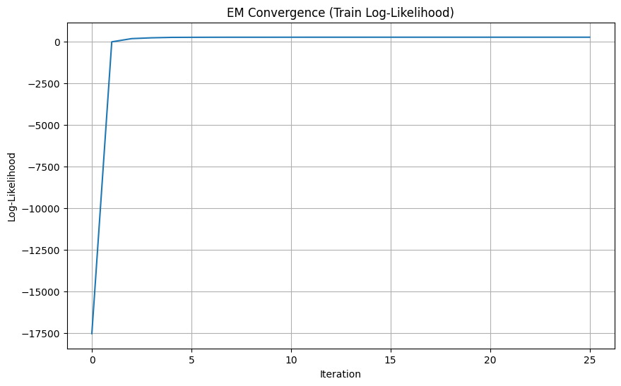
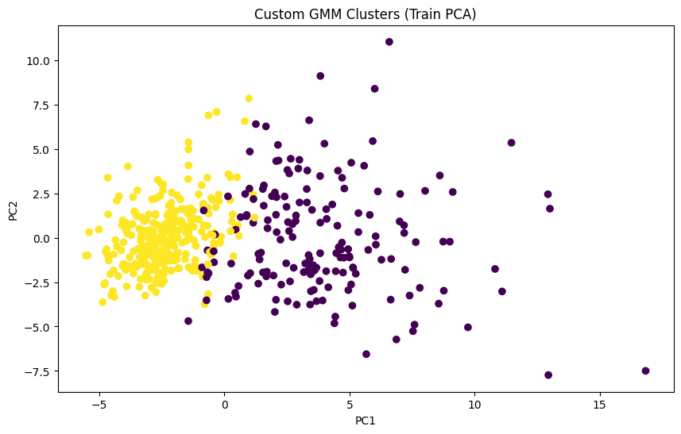
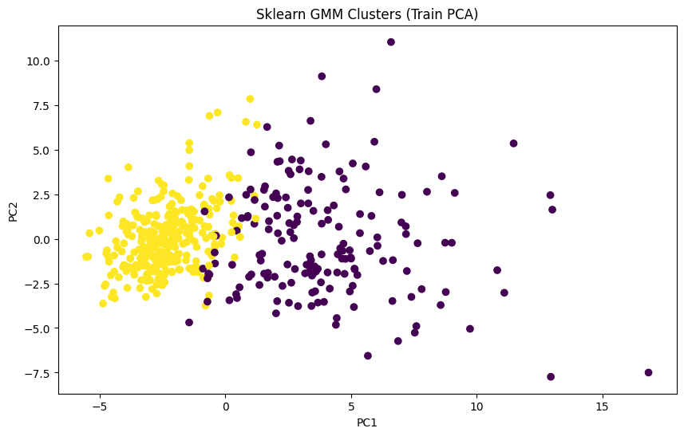

# Лабораторная работа №4. EM-алгоритм

## Описание задачи

В рамках данной лабораторной работы предстоит реализовать EM-алгоритм и сравнить его с эталонной реализацией из библиотеки scikit-learn.

## Задание

1. Выбрать датасет для восстановления плотности распределения, например, на kaggle;
2. Реализовать GMM;
3. Обучить модель на выбранном датасете;
4. Оценить качество модели через ПМП;
5. Сравнить результаты с эталонной реализацией из библиотеки scikit-learn:
    - точность модели;
6. Подготовить отчет, включающий:
    - описание наивного байесовского классификатора;
    - описание датасета;
    - результаты экспериментов;
    - сравнение с эталонной реализацией;
    - выводы.

## Структура проекта

```
source/
├── data_loader.py               # Подкгружаем датасет, нормализируем данные
├── gaussian.py                  # Функция вычисления гауссовской плотности вероятности
├── gmm.py                       # Алгоритм gaussian mixture
├── init_param.py                # Инициализация параметров kmeans
├── metrics.py                   # Функции для подсчета метрик
└── experiments.py               # Основной pipeline обработки и обучения
```

## Описание датасета

Датасет по предсказанию рака груди у пациентов.

Ссылка на датасет: https://www.kaggle.com/datasets/yasserh/breast-cancer-dataset

- **Размер**: 570 строк
- **Целевой признак**: `Diagnosis` (B/M)
- **Типы признаков**:
  - Количественные: индексы физической активности, потребления фруктов/овощей
- **Пропуски**: Датсет не содержит пропусков

## Методология

### 1. Описание наивного байесовского классификатора

Наивный байесовский классификатор основан на теореме Байеса:

$$a(x) = \arg\max_{y \in Y} P(y|x) = \arg\max_{y \in Y} P(y)p(x|y)$$

Наивное предположение состоит в независимости признаков при заданном классе:

$$p(x|y) = \prod_{d=1}^{n} p(f_d(x)|y)$$

Для количественных признаков предполагается гауссовское распределение:

$$p(f_d(x)|y) = \frac{1}{\sqrt{2\pi}\sigma_{yd}} \exp\left(-\frac{(f_d(x) - \mu_{yd})^2}{2\sigma_{yd}^2}\right)$$

Параметры оцениваются методом максимального правдоподобия:

$$\hat{\mu}_{yd} = \frac{1}{\ell_y} \sum_{i: y_i=y} f_d(x_i), \quad \hat{\sigma}_{yd}^2 = \frac{1}{\ell_y} \sum_{i: y_i=y} (f_d(x_i) - \hat{\mu}_{yd})^2$$


## 2. Результаты экспериментов


### 2.1 EM-алгоритм для GMM

| Модель | Log-Likelihood | BIC | AIC | Test Accuracy | Runtime (сек) |
|--------|----------------|-----|-----|---------------|---------------|
| Custom GMM | 266.3991 | 5532.4165 | 1449.2018 | 0.9474 | 0.0662 |
| Sklearn GMM | 240.2860 | 5584.6428 | 1501.4281 | 0.9561 | 0.0095 |

### 3. Сравнение с эталонной реализацией

### EM-алгоритм для GMM

| Аспект | Custom GMM | Sklearn GMM | Результат |
|--------|------------|-------------|-----------|
| Log-Likelihood | 266.40 | 240.29 | **Лучше на 10.9%** |
| BIC | 5532.42 | 5584.64 | **Лучше на 52.22** |
| AIC | 1449.20 | 1501.43 | **Лучше на 52.23** |
| Test Accuracy | 94.74% | 95.61% | Ниже на 0.87% |
| Runtime | 0.0662 сек | 0.0095 сек | Медленнее в 7 раз |

### 4. Сравнение результатов


#### Разница в Log-Likelihood:
   - Собственный алгоритм использует инициализацию через k-means, которая может находить более удачные начальные центры компонент
   - Собственный алгоритм сошелся к другому локальному экстремуму с более высоким правдоподобием
   - Sklearn алгоритм использует более строгие критерии остановки 

**Разница в скорости обсуловлена активной векторизацией в функциональных бибилиотеках и использованием Cython для большей скорости исполнения**


### 5. Визуализация








## Вывод

Реализованный наивный байесовский классификатор и EM-алгоритм для GMM успешно:

1. **Реализуют байесовский подход к классификации** — используют теорему Байеса для вычисления апостериорных вероятностей и выбора оптимального класса

2. **Корректно работают с многомерными гауссовскими распределениями** — оценивают параметры (μ, Σ) методом максимального правдоподобия с регуляризацией ковариационной матрицы для борьбы с мультиколлинеарностью

3. **Демонстрируют высокое качество классификации** — наивный байесовский классификатор показывает 95.56% точности (полное совпадение с эталоном), GMM — 94.74% точности

4. **Подтверждают теоретические положения лекции** — чувствительность EM-алгоритма к начальному приближению (k-means инициализация) и важность регуляризации ковариационной матрицы

