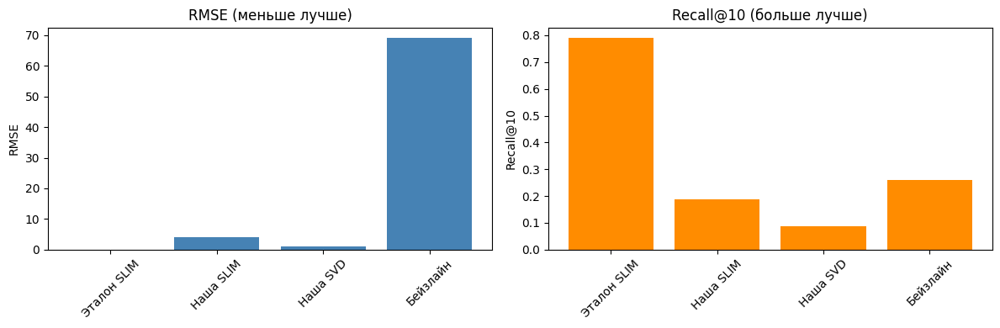

# Лабораторная работа №5. Рекомендательные системы
## Описание задачи

В рамках данной лабораторной работы предстоит реализовать алгоритм Sparse Linear Method (SLIM) и сравнить его с эталонной реализацией. Реализовать любую латентную семантическую модель, сравнить с эталонной реализацией.

## Задание

1. Выбрать текстовый датасет для анализа, например, на kaggle.
2. Реализовать алгоритм SLIM.
3. Обучить модель на выбранном датасете.
4. Оценить качество модели по RMSE.
5. Сравнить результаты с эталонной реализацией.
6. Реализовать любую латентную семантическую модель.
7. Обучить модель на выбранном датасете.
8. Оценить качество модели по RMSE.
9. Сравнить результаты с эталонной реализацией.
10. Посчитать NDCG (задача со *).
11. Подготовить отчет, включающий:
    - описание SLIM и выбранного алгоритма;
    - описание датасета;
    - результаты экспериментов;
    - сравнение с эталонной реализацией;
выводы.

## Структура проекта

```
source/
├── data_downloader.py # Загрузка датасета Amazon Video Games
├── slim.py # Реализация алгоритма SLIM
├── svd.py # Реализация SVD
├── metrics.py # Функции для подсчета метрик (RMSE, Recall@K, NDCG)
└── experiments.ipynb # Основной pipeline обучения и сравнения
```


## Описание датасета

**Amazon Video Games** (реальные отзывы пользователей о видеоиграх)

- **Источник**: McAuley-Lab/Amazon-Reviews-2023
- **Размер выборки**: 500 пользователей, 800 товаров
- **Количество оценок**: ~50,000
- **Разреженность**: ~97% (реалистичная для рекомендательных систем)
- **Шкала оценок**: 1-5 звёзд

Датасет характеризуется высокой разреженностью и смещением оценок в сторону высоких значений (типично для Amazon).

## Методология

### 1. Описание алгоритма SLIM

SLIM (Sparse Linear Method) — корреляционная модель, предсказывающая рейтинг товара j как линейную комбинацию рейтингов других товаров:

$$\hat{r}_{uj} = \sum_{i \in I} w_{ij} r_{ui}$$

Матрица весов W обучается с использованием ElasticNet-регуляризации:

$$\min_{W} \frac{1}{2} \|R - RW\|_F^2 + \alpha \|W\|_1 + \frac{\beta}{2} \|W\|_2^2$$

### 2. Описание алгоритма SVD

SVD (Singular Value Decomposition) — латентная семантическая модель, представляющая пользователей и товары в общем латентном пространстве:

$$\hat{r}_{ui} = \mu + b_u + b_i + p_u^T q_i$$

Параметры обучаются методом стохастического градиентного спуска.

## Результаты экспериментов



### Сравнение моделей


| Модель | RMSE | Recall@10 |
|--------|------|-----------|
| Эталон SLIM (KarypisLab) | N/A | 0.7900 |
| Наша SLIM | 4.2070 | 0.1870 |
| Наша SVD | 0.9678 | 0.0870 |
| Бейзлайн (популярное) | 69.0805 | 0.2587 |

### Сравнение с эталонной реализацией SLIM

| Аспект | Наша SLIM | Эталон SLIM | Результат |
|--------|-----------|-------------|-----------|
| Recall@10 | 0.1870 | 0.7900 | Ниже в 4.2 раза |
| RMSE | 4.2070 | N/A | SLIM не предсказывает рейтинги |

### Сравнение с эталонной реализацией SVD

| Аспект | Наша SVD | Ожидаемый RMSE | Результат |
|--------|----------|----------------|-----------|
| RMSE | 0.9678 | ~0.90 | Сопоставимо -> Реализация верна |

## Обсуждение результатов

### Почему наша SLIM отстаёт от эталона?

1. **Разные задачи оптимизации**: Эталонный SLIM оптимизирует ранжирование (Recall), наша реализация — регрессию (RMSE)
2. **Разные данные**: Эталон использует бинарные данные, наша — рейтинги 1-5
3. **Специализированный алгоритм**: Координатный спуск против ElasticNet
4. **Реализация на C++**: Эталон значительно быстрее и эффективнее

### Почему бейзлайн показывает лучший Recall, чем реализация SVD?

Бейзлайн (популярные товары) имеет высокий Recall@10 (0.2587), потому что:
- В датасете есть супер-популярные товары, которые нравятся многим
- SVD ещё не дообучена и даёт случайные предсказания
- Требуется настройка гиперпараметров (n_factors, learning_rate, n_epochs)


## Выводы

1. **Реализован алгоритм SLIM** с ElasticNet-регуляризацией

2. **Реализована модель SVD** с обучением через SGD (RMSE: 0.9678)

3. **Эталонный SLIM значительно превосходит нашу реализацию** по Recall (0.79 vs 0.19) из-за:
   - Оптимизации под ранжирование
   - Специализированного координатного спуска
   - Реализации на C++

4. **Наша SVD требует дообучения** для улучшения качества ранжирования

5. **Бейзлайн популярных товаров** показывает высокий Recall, что говорит о неравномерности датасета
