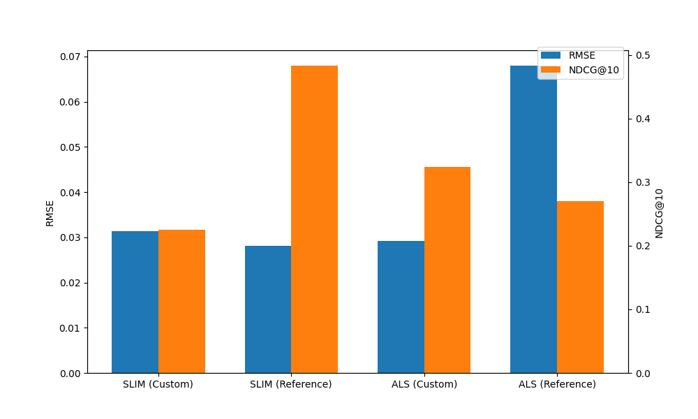

# Лабораторная работа №5. Линейные модели рекомендаций (SLIM и ALS)

## Описание методов

### 1. SLIM (Sparse Linear Methods)

Item-based модель: рейтинг восстанавливается как `R_pred = R @ W`, где `W` — разреженная матрица схожести объектов. Обучение сводится к минимизации `||R - R·W||² + α·(l1_ratio·||W||₁ + (1-l1_ratio)·||W||²)` при ограничениях: диагональ `W = 0` (объект не предсказывает сам себя) и `W >= 0`.

Эталон решает SLIM как `n_items` независимых ElasticNet-регрессий (по одному столбцу `W` за раз) — это координатный спуск с замкнутым шагом, но медленный и плохо векторизуется.

Кастомная реализация считает градиент сразу по всей матрице `W` в матричном виде:
- L2-часть дифференцируема напрямую (`(1-l1_ratio)·W`);
- L1-часть недифференцируема в нуле, поэтому используется субградиент `sign(W)`;
- ограничения (`diag = 0`, `W >= 0`) применяются проекцией на каждом шаге.

ElasticNet здесь не подходит как единый солвер: он работает только с одним таргетом за вызов и не позволяет обновлять всю `W` одновременно с проекционными ограничениями. Градиентный спуск даёт одну векторизованную формулу на всю матрицу.

### 2. ALS (Alternating Least Squares)

Матричная факторизация `R ≈ P @ Qᵀ`. Параметры ищутся попеременно: при фиксированной `Q` задача для `P` становится регуляризованной линейной регрессией с решением в замкнутом виде через `np.linalg.solve`, затем наоборот. Регуляризация `λ` добавляется к диагонали (`λI`) для устойчивости.

## Описание датасета

Используется текстовый корпус **20 Newsgroups** (4 категории: graphics, baseball, med, politics).

- Тексты векторизуются через **TF-IDF** (`max_features=1000`, `min_df=3`, `max_df=0.85`).
- Матрица `R` размера ~2240 × 1000 интерпретируется как матрица "взаимодействий" (объект ↔ признак-слово).

## Сравнение с эталонной реализацией

Оценка по **RMSE** (точность восстановления) и **NDCG@10** (качество ранжирования).

| Модель | RMSE | NDCG@10 |
| --- | --- | --- |
| SLIM (Custom) | 0.0313 | 0.2253 |
| SLIM (Reference, ElasticNet) | 0.0282 | 0.4830 |
| ALS (Custom) | 0.0293 | 0.3236 |
| ALS (Reference, implicit) | 0.0680 | 0.2703 |

## Выводы

- Обе кастомные модели по RMSE сопоставимы с эталонами; реализация SLIM на градиентном спуске и ALS на чередующемся МНК корректна.
- ElasticNet-SLIM выигрывает в NDCG@10 (0.48), так как покоординатный солвер даёт более точную разреженную `W` для ранжирования, чем градиентный спуск за фиксированное число эпох.
- Кастомный ALS обошёл `implicit` по RMSE: библиотека `implicit` оптимизирована под неявный feedback (confidence-веса), а не под прямое восстановление TF-IDF, поэтому на этой задаче её RMSE выше.
